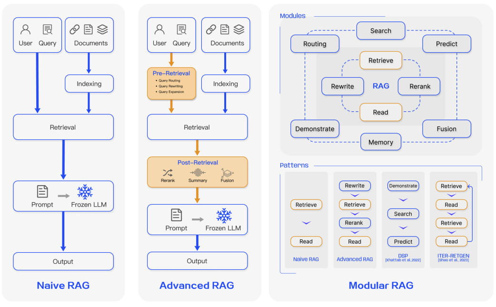
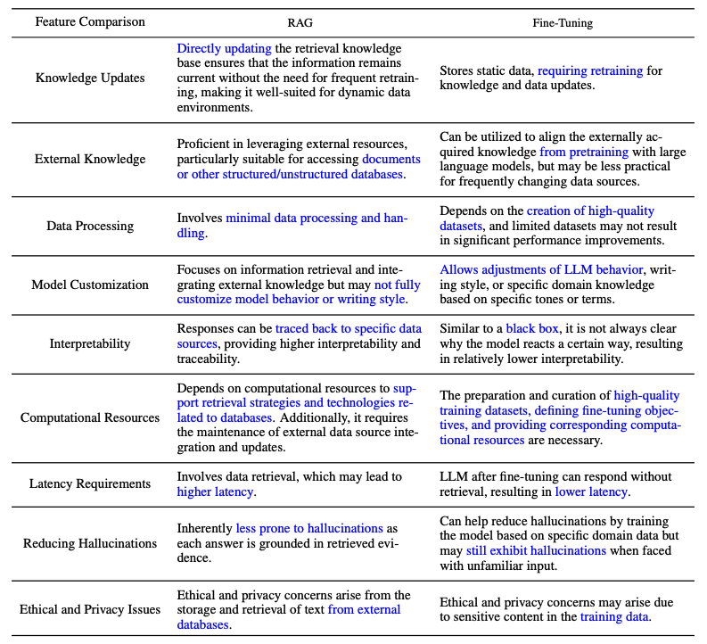

# Retrieval Augmented Generation（RAG）在 LLM 中的應用

import { Callout } from 'nextra/components'

在使用大型語言模型（LLM）時，常會遇到領域知識缺口、事實正確性問題，以及幻覺等挑戰。Retrieval Augmented Generation（RAG）透過把 LLM 與外部知識（例如資料庫）結合，協助緩解其中部分問題。RAG 特別適合知識密集或特定領域的應用情境，尤其是知識會持續更新的場景。相較於其他做法，RAG 的一個關鍵優勢是：不需要為特定任務重新訓練 LLM。近年來，RAG 也因為在對話型 Agent 等應用中的成功而快速普及。

本節整理近期綜論 [Retrieval-Augmented Generation for Large Language Models: A Survey](https://arxiv.org/abs/2312.10997)（Gao et al., 2023）的主要發現與實務洞見。我們特別聚焦於：現有方法、最先進的 RAG、評估方式、應用案例，以及組成 RAG 系統的各項元件技術（檢索、產生與增強）。

## RAG 入門

在另一篇簡介中（見 [這裡](https://www.promptingguide.ai/techniques/rag)），RAG 可以簡單描述為：

> RAG 會先根據輸入，從某個來源（例如 Wikipedia）檢索一組相關或可支援的文件。接著，系統會把這些文件與原始提示詞（prompt）串接成上下文，一起送入文字產生器並產生最終輸出。由於事實可能隨時間演變，而 LLM 的參數化知識本質上是靜態的，因此 RAG 能讓語言模型在不重新訓練的情況下，透過檢索式產生存取最新資訊，進而產生更可靠的輸出。

簡言之，RAG 中檢索到的證據可以提升 LLM 回應的：

- 正確性
- 可控性
- 與使用者問題的相關度

這也是為什麼在高度快速變動的環境中，RAG 能有效降低幻覺或效能退化的問題。

雖然早期 RAG 也包含對預訓練方法的最佳化，但目前主流做法已大幅轉向：結合 RAG 與強大的微調模型（例如 [ChatGPT](https://www.promptingguide.ai/models/chatgpt) 與 [Mixtral](https://www.promptingguide.ai/models/mixtral)）。下圖顯示 RAG 相關研究的大致演進：

*[圖源](https://arxiv.org/abs/2312.10997)*

下圖是典型 RAG 應用流程：

*[圖源](https://arxiv.org/abs/2312.10997)*

各步驟可概括如下：

- **Input：** 系統要回應的問題。如果沒有使用 RAG，就會直接由 LLM 回答。
- **Indexing：** 若使用 RAG，會先把相關文件切分成 chunks、為每個 chunk 建立向量表示，並寫入向量資料庫；推論時也會把查詢用相同方式轉成向量。
- **Retrieval：** 透過比對查詢向量與索引向量，找出相關文件片段（也常被稱為「Relevant Documents」）。
- **Generation：** 把檢索到的文件片段與原始提示詞合併成上下文，再送入模型產生回應，並整理成系統對使用者的最終輸出。

在示意案例中，如果只用模型本身來回答近期事件，常會因缺乏最新資訊而失敗；加入 RAG 後，系統就能拉取模型回應所需的相關資訊，協助模型做出更合適的回答。

<Callout type= "info" emoji="🎓">
想更深入掌握 RAG 與進階提示詞方法？歡迎參考我們的新 AI 課程。[立即加入！](https://dair-ai.thinkific.com/)

使用優惠碼 PROMPTING20 可享額外 8 折優惠。
</Callout>

## RAG 典範

過去幾年，RAG 系統從 Naive RAG 演進到 Advanced RAG，再到 Modular RAG；這些演進主要是為了處理效能、成本與效率等面向的限制。

*[圖源](https://arxiv.org/abs/2312.10997)*

### Naive RAG

Naive RAG 沿用傳統流程：索引、檢索、產生。簡單說，使用者輸入會用來查詢相關文件；接著，系統會把文件與提示詞結合後送入模型，產生最終回應。如果應用涉及多輪對話，也可以把對話歷史整合進提示詞。

Naive RAG 也有一些限制，例如：低精準度（檢索到的 chunks 不夠貼題）與低召回率（無法把所有相關 chunks 都找回來）。此外，也可能把過時資訊送進 LLM，而這正是 RAG 一開始就應該要處理的主要問題之一；否則就容易導致幻覺與不精準的回應。

當引入增強內容後，也可能出現冗餘與重複等問題。當同時使用多段檢索內容時，如何排序與統一風格／語氣同樣重要。另一個挑戰是：要避免產生步驟過度仰賴增強內容，導致模型只是反覆轉述檢索到的文字。

### Advanced RAG

Advanced RAG 主要用來處理 Naive RAG 的問題，尤其是提升檢索品質。它可能包含對檢索前、檢索中、檢索後等流程做最佳化。

檢索前流程包含最佳化資料索引，以提升被索引資料的品質；常見會涵蓋五個階段：提升資料粒度、最佳化索引結構、加入中繼資料、對齊最佳化、以及混合式檢索。

檢索階段也可以透過最佳化 embedding 模型來改善，因為它會直接影響上下文 chunk 的品質。做法包含：微調 embedding 以提升檢索相關性，或採用能更好捕捉脈絡理解的動態 embeddings（例如 OpenAI 的 embeddings-ada-02 模型）。

檢索後最佳化則聚焦於避開 context window 限制，並處理雜訊或可能分散注意力的資訊。常見作法是 reranking，例如把更相關的內容重新放到提示詞的兩端，或重新計算查詢與各個文字 chunk 的語意相似度；另外也能透過 prompt 壓縮來改善。

### Modular RAG

顧名思義，Modular RAG 會強化可替換的功能模組，例如加入相似度檢索的搜尋模組，或在 retriever 上做微調。Naive RAG 與 Advanced RAG 都可以被視為 Modular RAG 的特殊情況（由固定模組組成）。更進階的 RAG 模組還包含 search、memory、fusion、routing、predict、task adapter 等，用來處理不同問題；也可以根據特定情境重新組裝模組順序。因此，Modular RAG 具備更高的多樣性與彈性：你可以新增、替換模組，或依任務需求調整模組之間的流程。

隨著建構 RAG 系統的彈性提升，也出現不少針對 RAG pipeline 的重要最佳化技巧，例如：

- **Hybrid Search Exploration：** 結合關鍵字搜尋與語意搜尋等多種檢索方式，以拉回更相關、脈絡更完整的資訊；特別適合處理多樣化查詢與不同資訊需求。
- **Recursive Retrieval and Query Engine：** 以遞迴式檢索流程為核心，可能先從小的語意 chunks 開始，逐步再拉回更大的 chunks 以補足脈絡；用於在效率與脈絡完整度之間取得平衡。
- **StepBack-prompt：** 一種[提示詞技巧](https://arxiv.org/abs/2310.06117)，讓 LLM 先做抽象化，產生引導推理的概念與原則；套用在 RAG 架構中，能讓模型在需要時跳脫特定案例、用更宏觀的角度推理，回應也更有依據。
- **Sub-Queries：** 可用樹狀查詢、序列式查詢 chunks 等不同查詢策略來因應不同情境。LlamaIndex 提供了 [sub question query engine](https://docs.llamaindex.ai/en/latest/understanding/putting_it_all_together/agents.html#)，能把一個查詢拆解成多個問題，並對應不同資料來源。
- **Hypothetical Document Embeddings：** [HyDE](https://arxiv.org/abs/2212.10496) 會先為查詢產生一個假想答案，再把它嵌入成向量，並用這個向量去檢索與「假想答案」相似的文件，而不是直接用查詢本身做檢索。

## RAG 架構

本節整理 RAG 系統三個核心元件（檢索、產生、增強）的關鍵發展。

### 檢索（Retrieval）

檢索是 RAG 中負責從檢索器（retriever）取得高度相關脈絡的元件。檢索器可以用很多方式加強，包含：

**強化語意表示（Enhancing Semantic Representations）**

這個流程會直接改善支撐檢索器運作的語意表示。以下是幾個重點：

- **Chunking：** 一個重要步驟是選擇合適的切分策略；這取決於資料內容，以及你要產生回應的應用情境。不同模型在不同 block size 上的表現也不同：例如 Sentence Transformers 通常在單句表現較好，而 text-embedding-ada-002 在包含 256 或 512 tokens 的區塊表現較佳。其他還需要考量的因素包括使用者問題長度、應用型態與 token 限制；實務上也常透過嘗試不同切分策略來最佳化 RAG 系統的檢索效果。
- **Fine-tuned Embedding Models：** 當你確立了有效的切分策略後，如果資料屬於專門領域，可能就需要微調 embedding 模型；否則使用者查詢在你的應用中可能會被完全誤解。你可以在廣泛領域知識（domain knowledge fine-tuning）以及特定下游任務上做微調。[BAAI 開發的 BGE-large-EN](https://github.com/FlagOpen/FlagEmbedding) 是一個值得注意的 embedding 模型，可透過微調來提升檢索相關性。

**對齊查詢與文件（Aligning Queries and Documents）**

這個流程聚焦在語意空間中，讓使用者查詢能更貼近文件表徵；當查詢缺少語意資訊或措辭不精準時特別有用。常見作法包括：

- **Query Rewriting：** 透過多種技巧重寫查詢，例如 [Query2Doc](https://arxiv.org/abs/2303.07678)、[ITER-RETGEN](https://arxiv.org/abs/2305.15294) 與 HyDE。
- **Embedding Transformation：** 最佳化查詢向量的表示，讓它更貼近某個與任務高度相關的潛在空間。

**對齊 Retriever 與 LLM（Aligning Retriever and LLM）**

這個流程著重在讓 retriever 的輸出更符合 LLM 的偏好。

- **Fine-tuning Retrievers：** 利用 LLM 的回饋訊號來精煉檢索模型。常見例子包含 augmentation adapted retriever（[AAR](https://arxiv.org/abs/2305.17331)）、[REPLUG](https://arxiv.org/abs/2301.12652) 與 [UPRISE](https://arxiv.org/abs/2303.08518) 等。
- **Adapters：** 引入外部 adapters 來協助對齊流程，例如 [PRCA](https://aclanthology.org/2023.emnlp-main.326/)、[RECOMP](https://arxiv.org/abs/2310.04408) 與 [PKG](https://arxiv.org/abs/2305.04757)。

### 產生（Generation）

RAG 系統中的產生器（generator）負責把檢索到的資訊轉成一段連貫文字，作為模型的最終輸出。這個流程會接觸多樣化的輸入資料，因此有時需要調整語言模型對來自查詢與文件的輸入資料之適應方式。常見可透過檢索後處理與微調來改善：

- **Post-retrieval with Frozen LLM：** 檢索後處理會保持 LLM 不變，改以資訊壓縮與結果 reranking 等操作來提升檢索結果品質。資訊壓縮可降低雜訊、處理 LLM 的 context 長度限制，並改善產生效果；reranking 則是重新排序文件，讓最相關的內容優先排在前面。
- **Fine-tuning LLM for RAG：** 為了提升 RAG 系統，產生器也可以進一步最佳化或微調，以確保產生文字自然，且能有效運用檢索到的文件。

### 增強（Augmentation）

增強指的是：把檢索到的段落脈絡有效整合到目前的產生任務中。在討論增強流程、增強階段與增強資料之前，先看一下 RAG 核心元件的分類法：

*[圖源](https://arxiv.org/abs/2312.10997)*

檢索增強可以發生在不同階段，例如預訓練、微調與推論。

- **Augmentation Stages：** [RETRO](https://arxiv.org/abs/2112.04426) 是一個利用檢索增強進行大規模、從零開始預訓練的例子；它會在外部知識之上再加一個額外 encoder。微調也可以與 RAG 結合，協助開發並提升 RAG 系統的效果。在推論階段，則會套用多種技巧來有效整合檢索內容，以符合特定任務需求，並進一步精煉 RAG 流程。
- **Augmentation Source：** RAG 模型的效果高度受增強資料來源的選擇影響。資料可以分成非結構化、結構化，以及 LLM 產生的資料。
- **Augmentation Process：** 對許多問題（例如多步推理）而言，單次檢索不足以支撐；因此有幾種方法被提出：
    - **Iterative retrieval：** 讓模型做多次檢索循環，以提升資訊深度與相關性。代表性方法包含 [RETRO](https://arxiv.org/abs/2112.04426) 與 [GAR-meets-RAG](https://arxiv.org/abs/2310.20158)。
    - **Recursive retrieval：** 把某次檢索的輸出再作為下一次檢索的輸入，遞迴地往下鑽；用於處理複雜、多步查詢（例如學術研究與法律案例分析）。代表性方法包含 [IRCoT](https://arxiv.org/abs/2212.10509) 與 [Tree of Clarifications](https://arxiv.org/abs/2310.14696)。
    - **Adaptive retrieval：** 透過判斷「最佳檢索時機」與「該檢索哪些內容」，來因應特定需求並調整檢索流程。代表性方法包含 [FLARE](https://arxiv.org/abs/2305.06983) 與 [Self-RAG](https://arxiv.org/abs/2310.11511)。

下圖呈現 RAG 研究中更細緻的增強面向，包含增強階段、資料來源與增強流程：

*[圖源](https://arxiv.org/abs/2312.10997)*

### RAG vs. 微調（Fine-tuning）

關於 RAG 與微調的差異，以及各自適合的情境，一直都有許多討論。相關研究指出：RAG 適合用來整合新知，而微調則可以透過改善內部知識、輸出格式，以及教會模型遵循複雜指令等方式，來提升模型效能與效率。這兩種做法並非互斥；它們可以在一個反覆迭代的流程中相互補強，目標是把 LLM 更好地用在一個複雜、知識密集、可擴張的應用：需要存取快速變動的知識，並產生符合特定格式、語氣與風格的客製化回應。此外，提示詞工程也能透過善用模型固有能力來最佳化結果。下圖比較了 RAG 與其他模型最佳化方法的差異特性：

*[圖源](https://arxiv.org/abs/2312.10997)*

以下是綜論論文中的一張表格，用來比較 RAG 與微調模型在特性上的差異：

*[圖源](https://arxiv.org/abs/2312.10997)*

## RAG 評估

和衡量 LLM 在不同面向的表現類似，評估在理解並最佳化 RAG 模型於不同應用情境下的效能上扮演關鍵角色。傳統上，RAG 系統常以特定下游任務的表現來評估，並使用如 F1、EM 等任務指標。[RaLLe](https://arxiv.org/abs/2308.10633v2) 是一個值得注意的框架，用於評估面向知識密集任務的檢索擴增大型語言模型。

RAG 的評估會同時針對檢索與產生兩個面向：一方面要評估檢索到的脈絡品質，另一方面也要評估產生內容的品質。評估檢索品質時，常會採用推薦系統與資訊檢索等知識密集領域的指標，例如 NDCG 與 Hit Rate。評估產生品質時，若內容沒有標註，可以評估相關度與有害性等面向；若內容有標註，則可評估正確性。整體來說，RAG 評估可以採用人工或自動化方法。

評估一個 RAG 架構通常聚焦於三個主要品質分數與四個能力。品質分數包含：脈絡相關性（context relevance；也就是檢索脈絡的精準度與聚焦程度）、答案忠實度（answer faithfulness；答案對檢索脈絡的忠實程度）、以及答案相關性（answer relevance；答案對問題的相關程度）。此外，還有四個能力可用來衡量 RAG 系統的適應性與效率：雜訊韌性（noise robustness）、負向拒答（negative rejection）、資訊整合（information integration）、以及反事實韌性（counterfactual robustness）。下圖整理了評估 RAG 系統不同面向的指標：

*[圖源](https://arxiv.org/abs/2312.10997)*

[RGB](https://arxiv.org/abs/2309.01431) 與 [RECALL](https://arxiv.org/abs/2311.08147) 等基準，常被用來評估 RAG 模型。也有許多工具被開發來自動化 RAG 系統評估，例如 [RAGAS](https://arxiv.org/abs/2309.15217)、[ARES](https://arxiv.org/abs/2311.09476) 與 [TruLens](https://www.trulens.org/trulens_eval/core_concepts_rag_triad/)。其中有些系統會仰賴 LLM 來推定上面提到的部分品質分數。

## RAG 的挑戰與未來

在本篇概觀中，我們討論了 RAG 研究的多個面向，以及如何強化 RAG 系統的檢索、增強與產生。以下是 [Gao et al., 2023](https://arxiv.org/abs/2312.10997) 強調、在持續開發與改進 RAG 系統時需要面對的挑戰：

- **Context length：** LLM 的 context window 持續變長，RAG 該如何調整以確保能捕捉到高度相關且重要的脈絡，成為新的挑戰。
- **Robustness：** 如何面對反事實與對抗式資訊，是衡量並提升 RAG 系統的重要課題。
- **Hybrid approaches：** 仍持續需要研究：如何在 RAG 與微調模型之間取得最佳搭配與最佳化策略。
- **延伸 LLM 角色：** 進一步提升 LLM 的角色與能力，以強化 RAG 系統，是高度受關注的方向。
- **Scaling laws：** LLM 的 scaling laws 如何套用在 RAG 系統上，目前仍未被充分理解。
- **正式環境可用的 RAG：** 要把 RAG 做到 production-grade，需要在效能、效率、資料安全、隱私等面向做到工程卓越。
- **Multimodal RAG：** 過去 RAG 研究多集中在文字任務，但目前越來越多人關注把 RAG 延伸到影像、音訊、影片、程式碼等模態，以支援更多領域問題。
- **Evaluation：** 隨著 RAG 被用來打造更複雜的應用，必須發展更細緻的指標與評估工具，才能更可靠地衡量脈絡相關性、創意度、內容多樣性、事實正確性等面向；同時也需要更好的可解釋性研究與工具。

## RAG 工具

常見的完整 RAG 建構工具包含 [LangChain](https://www.langchain.com/)、[LlamaIndex](https://www.llamaindex.ai/) 與 [DSPy](https://github.com/stanfordnlp/dspy)。也有許多專門用途的工具，例如 [Flowise AI](https://flowiseai.com/) 提供低程式碼（low-code）方式來建構 RAG 應用。其他值得注意的技術還包含 [HayStack](https://haystack.deepset.ai/)、[Meltano](https://meltano.com/)、[Cohere Coral](https://cohere.com/coral) 等。軟體與雲端服務供應商也開始推出以 RAG 為核心的服務；例如 Weaviate 的 Verba 適合用來打造個人助理應用，而 Amazon 的 Kendra 提供智慧化企業搜尋服務。

## 結論

總結來說，RAG 系統在近年快速演進，包含更進階的典範，讓 RAG 能在更廣泛領域中提升效能與實用性。RAG 應用需求非常強烈，也加速了針對 RAG 各元件的改進方法。從混合式方法到 self-retrieval，都是現代 RAG 模型正在探索的研究方向。同時，對更好的評估工具與指標也有更高需求。下圖回顧了本篇涵蓋的 RAG 生態系：強化 RAG 的技巧、挑戰，以及其他相關面向：

*[圖源](https://arxiv.org/abs/2312.10997)*

---

## RAG 研究洞見

以下整理一系列研究論文，涵蓋 RAG 的關鍵洞見與最新進展。

| **洞見**  | **參考資料** | **日期** |
| ------------- | ------------- | ------------- |
| 說明如何透過訓練「檢索擴增模擬器」，用檢索擴增來蒸餾語言模型助理。 | [KAUCUS: Knowledge Augmented User Simulators for Training Language Model Assistants](https://aclanthology.org/2024.scichat-1.5)| Mar 2024 |
| 提出 Corrective Retrieval Augmented Generation（CRAG）以提升 RAG 系統在產生階段的韌性。核心概念是：為 retriever 加入自我修正元件，並改善檢索文件在增強產生時的使用方式。retrieval evaluator 會評估在某個查詢下檢索文件的整體品質；再透過網頁搜尋與最佳化知識運用等操作，提升自動自我修正與文件使用效率。 | [Corrective Retrieval Augmented Generation](https://arxiv.org/abs/2401.15884)| Jan 2024|
| 以遞迴方式對文字 chunks 做嵌入、分群與摘要，自下而上建立具有不同摘要層級的樹狀結構；推論時，RAPTOR 會從樹上檢索，並在不同抽象層級整合長文件資訊。 | [RAPTOR: Recursive Abstractive Processing for Tree-Organized Retrieval](https://arxiv.org/abs/2401.18059)| Jan 2024 |
| 提出一個通用程式，讓語言模型與 retriever 做多步互動，以更有效率地處理多標籤分類問題。 | [In-Context Learning for Extreme Multi-Label Classification](https://arxiv.org/abs/2401.12178) | Jan 2024 |
| 從資源豐富語言中擷取語意相近的提示詞，提升多語系預訓練語言模型在各種任務上的零樣本表現。 | [From Classification to Generation: Insights into Crosslingual Retrieval Augmented ICL](https://arxiv.org/abs/2311.06595) | Nov 2023|
| 提升 RAG 在面對雜訊、無關文件與未知情境時的韌性。它會為檢索文件產生連續的閱讀筆記，協助完整評估與問題的相關性，並整合資訊來準備最終答案。 | [Chain-of-Note: Enhancing Robustness in Retrieval-Augmented Language Models](https://arxiv.org/abs/2311.09210)| Nov 2023 |
| 刪除對讀取器（reader）的答案產生流程不一定有關鍵貢獻的 tokens，以最佳化答案產生；可把執行時間降低最多 62.2%，效能只下降約 2%。 | [Optimizing Retrieval-augmented Reader Models via Token Elimination](https://arxiv.org/abs/2310.13682) |  Oct  2023 |
| 以指令微調一個小型 LM verifier，搭配獨立 verifier 驗證知識增強型語言模型的輸出與知識運用。用於處理：模型檢索不到相關知識，或產生內容未忠實反映檢索知識等情境。 | [Knowledge-Augmented Language Model Verification](https://arxiv.org/abs/2310.12836) |  Oct  2023 |
| 建立一個基準來分析不同 LLM 在 RAG 所需的四項基本能力之表現：雜訊韌性、負向拒答、資訊整合與反事實韌性。 | [Benchmarking Large Language Models in Retrieval-Augmented Generation](https://arxiv.org/abs/2309.01431) |  Oct  2023 |
| 提出 Self-Reflective Retrieval-Augmented Generation（Self-RAG）框架，透過檢索與自我反思提升 LM 的品質與事實正確性。它會讓 LM 自行決定是否檢索，並用 reflection tokens 對檢索內容與自身產生結果進行產生與反思。 | [Self-RAG: Learning to Retrieve, Generate, and Critique through Self-Reflection](https://arxiv.org/abs/2310.11511) | Oct 2023 |
| 透過 generation-augmented retrieval（GAR）反覆改進檢索，再透過 RAG 改善重寫流程；其中重寫－檢索階段提升召回率，而 reranking 階段則提升精準度。 | [GAR-meets-RAG Paradigm for Zero-Shot Information Retrieval](https://arxiv.org/abs/2310.20158) | Oct 2023 |
| 以基礎 43B GPT 模型為底，並從 1.2 兆 tokens 檢索來預訓練一個 48B 檢索模型；再做指令微調，使其在廣泛的零樣本任務上顯著優於指令微調的 GPT。 | [InstructRetro: Instruction Tuning post Retrieval-Augmented Pretraining](https://arxiv.org/abs/2310.07713) | Oct 2023|
| 透過兩個不同的微調步驟，讓 LLM 具備檢索能力：第一步更新預訓練 LM，使其更善用檢索資訊；第二步更新 retriever，使其依 LM 偏好回傳更相關的結果。針對需要知識運用與脈絡理解的任務做微調後，每個階段都能帶來效能提升。 | [RA-DIT: Retrieval-Augmented Dual Instruction Tuning](https://arxiv.org/abs/2310.01352) | Oct 2023 |
| 一種讓 RAG 對無關內容更有韌性的方法。它會自動產生資料，並在訓練時混合相關與無關脈絡，微調語言模型以正確運用檢索段落。 | [Making Retrieval-Augmented Language Models Robust to Irrelevant Context](https://arxiv.org/abs/2310.01558) |Oct 2023|
| 發現在 4K context window 的 LLM 上，只要在產生階段套用簡單檢索增強，就能在長脈絡任務上達到與 16K context window、透過 positional interpolation 微調的 LLM 相當的表現。 | [Retrieval meets Long Context Large Language Models](https://arxiv.org/abs/2310.03025)| Oct 2023|
| 在把檢索文件納入上下文前，先把文件壓縮成文字摘要，以降低計算成本，並減輕 LM 在長文件中辨識關鍵資訊的負擔。 | [RECOMP: Improving Retrieval-Augmented LMs with Compression and Selective Augmentation](https://arxiv.org/abs/2310.04408)| Oct 2023|
| 一種檢索－產生協作框架，結合參數化與非參數化知識，並透過檢索與產生互動找到正確推理路徑；對需要多步推理的任務特別有用，並能整體提升 LLM 推理能力。 | [Retrieval-Generation Synergy Augmented Large Language Models](https://arxiv.org/abs/2310.05149)| Oct 2023|
| 提出 Tree of Clarifications（ToC）：透過 few-shot 提示詞與外部知識，遞迴建立「歧義消解」樹；再利用這棵樹產生長篇回答。 | [Tree of Clarifications: Answering Ambiguous Questions with Retrieval-Augmented Large Language Models](https://arxiv.org/abs/2310.14696) | Oct 2023 |
| 一種讓 LLM 能參考過去遇過的問題，並在遇到新問題時自適應地呼叫外部資源的方法。 | [Self-Knowledge Guided Retrieval Augmentation for Large Language Models](https://arxiv.org/abs/2310.05002)| Oct 2023|
| 一套可用來評估 RAG 不同面向的指標，不需仰賴人工標註的 ground truth；包含檢索系統找出相關且聚焦脈絡段落的能力、LLM 忠實運用段落的能力，以及產生內容本身的品質。 | [RAGAS: Automated Evaluation of Retrieval Augmented Generation](https://arxiv.org/abs/2309.15217) | Sep 2023 |
| 提出 generate-then-read（GenRead）方法：先向 LLM 下提示詞，依問題產生脈絡文件，再讀取這些「產生的文件」來產生最終答案。 | [Generate rather than Retrieve: Large Language Models are Strong Context Generators](https://arxiv.org/abs/2209.10063)| Sep 2023 |
| 示範如何在 RAG 系統中利用 DiversityRanker、LostInTheMiddleRanker 等 ranker，來挑選與運用資訊，以最佳化 LLM 的 context window 使用效率。 | [Enhancing RAG Pipelines in Haystack: Introducing DiversityRanker and LostInTheMiddleRanker](https://towardsdatascience.com/enhancing-rag-pipelines-in-haystack-45f14e2bc9f5) | Aug  2023 |
| 讓 LLM 能與多種知識庫（KB）串接，提供知識檢索與儲存能力。檢索流程會用 program of thought prompting，以程式碼形式、搭配預先定義的 KB 操作函式產生搜尋語言；同時也能把知識儲存在個人化 KB，以因應個別需求。 | [KnowledGPT: Enhancing Large Language Models with Retrieval and Storage Access on Knowledge Bases](https://arxiv.org/abs/2308.11761) | Aug 2023|
| 提出一個結合「檢索增強遮罩語言建模」與「prefix 語言建模」的模型，並引入 Fusion-in-Context Learning，讓模型在不需要額外訓練的情況下，能運用更多 in-context 範例來提升 few-shot 表現。 | [RAVEN: In-Context Learning with Retrieval Augmented Encoder-Decoder Language Models](https://arxiv.org/abs/2308.07922)| Aug 2023|
| RaLLe 是一個開源框架，用於開發、評估與最佳化面向知識密集任務的 RAG 系統。 | [RaLLe: A Framework for Developing and Evaluating Retrieval-Augmented Large Language Models](https://arxiv.org/abs/2308.10633) | Aug 2023|
| 發現當相關資訊在輸入脈絡中的位置改變時，LLM 表現可能大幅下降；顯示 LLM 在長輸入脈絡中並不會穩健地運用資訊。 | [Lost in the Middle: How Language Models Use Long Contexts](https://arxiv.org/abs/2307.03172) | Jul 2023 |
| 以迭代方式結合檢索與產生：模型輸出會指出完成任務仍需要哪些內容，進而提供更具資訊量的脈絡來檢索更相關知識；而檢索到的新知識又能幫助下一輪產生更好的輸出。 | [Enhancing Retrieval-Augmented Large Language Models with Iterative Retrieval-Generation Synergy](https://arxiv.org/abs/2305.15294) | May 2023|
| 提供 active RAG 的一般化觀點：在產生過程中主動決定何時檢索、檢索什麼；並提出 Forward-Looking Active Retrieval augmented generation（FLARE），透過預測下一句來預先推估未來內容，並把它當作查詢來檢索相關文件；若句子包含低信心 tokens，則會用檢索結果重新產生該句。 | [Active Retrieval Augmented Generation](https://arxiv.org/abs/2305.06983)| May 2023|
| 提出通用檢索 plug-in：利用通用 retriever 來增強目標 LM，即使目標 LM 事先未知或無法做共同微調也能使用。 | [Augmentation-Adapted Retriever Improves Generalization of Language Models as Generic Plug-In](https://arxiv.org/abs/2305.17331)| May 2023|
| 透過兩種預訓練策略提升結構化資料的 dense retrieval：先利用結構化與非結構化資料的自然對齊來做 structure-aware 預訓練；再使用 Masked Entity Prediction 來捕捉結構語意。 | [Structure-Aware Language Model Pretraining Improves Dense Retrieval on Structured Data](https://arxiv.org/abs/2305.19912) | May 2023 |
| 動態整合多領域、異質來源的 grounding 資訊，以提升 LLM 的事實正確性；並引入自適應查詢產生器，處理針對不同知識來源客製化的查詢。同時會逐步修正推理過程，避免前一步推理的不精準擴散到後續步驟。 | [Chain-of-Knowledge: Grounding Large Language Models via Dynamic Knowledge Adapting over Heterogeneous Sources](https://arxiv.org/abs/2305.13269) | May 2023 |
| 一個利用知識圖譜（KG）產生與脈絡相關、且具知識依據對話的框架。它會先從 KG 檢索相關子圖，再在檢索子圖條件下擾動詞向量以強化事實一致性；並使用對比學習，讓產生文字與檢索子圖具高度相似性。 | [Knowledge Graph-Augmented Language Models for Knowledge-Grounded Dialogue Generation](https://arxiv.org/abs/2305.18846)| May 2023|
| 使用小型語言模型作為可訓練的 rewriter，以配合黑盒 LLM reader；rewriter 透過強化學習（RL）使用 reader 回饋來訓練，形成 Rewrite-Retrieve-Read 框架，聚焦在最佳化查詢。 | [Query Rewriting for Retrieval-Augmented Large Language Models](https://arxiv.org/abs/2305.14283)| May 2023 |
| 反覆使用檢索增強產生器建立無上限的記憶池，並用 memory selector 選擇一個輸出作為下一輪的記憶；讓模型能運用自己的輸出（self-memory）來改善產生效果。 | [Lift Yourself Up: Retrieval-augmented Text Generation with Self Memory](https://arxiv.org/abs/2305.02437) | May 2023 |
| 讓 LLM 在不改動參數的情況下，透過知識引導模組存取相關知識；提升「黑盒」LLM 在多種知識密集任務上的表現，包含事實（+7.9%）、表格（+11.9%）、醫療（+3.0%）與多模態（+8.1%）知識。 | [Augmented Large Language Models with Parametric Knowledge Guiding](https://arxiv.org/abs/2305.04757) | May 2023|
| 讓 LLM 具備通用的 write-read 記憶單元，能視需要從文字中擷取、儲存並回憶知識，以支援任務表現。 | [RET-LLM: Towards a General Read-Write Memory for Large Language Models](https://arxiv.org/abs/2305.14322) | May 2023|
| 採用 task-agnostic retriever 建立共享、靜態索引，以有效率地選取候選證據；再設計 prompt-guided reranker，依任務相關性對最接近的證據做 reranking。 | [Prompt-Guided Retrieval Augmentation for Non-Knowledge-Intensive Tasks](https://arxiv.org/abs/2305.17653)| May 2023|
| 提出 UPRISE（Universal Prompt Retrieval for Improving zero-Shot Evaluation）：微調一個輕量且通用的 retriever，能為指定的零樣本任務輸入自動檢索提示詞。 | [UPRISE: Universal Prompt Retrieval for Improving Zero-Shot Evaluation](https://arxiv.org/abs/2303.08518) | Mar 2023 |
| 提出一種自適應的「filter-then-rerank」典範：結合小型語言模型（作為 filter）與 LLM（作為 reranker）的優點。 | [Large Language Model Is Not a Good Few-shot Information Extractor, but a Good Reranker for Hard Samples!](https://arxiv.org/abs/2303.08559) | Mar 2023 |
| 在零樣本設定下，先引導能遵循指令的 LLM 產生一份能捕捉相關性模式的假想文件；再由 Contriever 把文件編碼成嵌入向量，並用向量相似度在語料庫嵌入空間中找出鄰近區域，檢索出相似的真實文件。 | [Precise Zero-Shot Dense Retrieval without Relevance Labels](https://arxiv.org/abs/2212.10496)| Dec 2022|
| 提出 Demonstrate-Search-Predict（DSP）框架：撰寫高階程式來先建立流程示範，接著搜尋相關段落，再產生具依據的預測；以系統化方式把問題拆解成更小、能更可靠處理的轉換步驟。 | [Demonstrate-Search-Predict: Composing retrieval and language models for knowledge-intensive NLP](https://arxiv.org/abs/2212.14024) | Dec 2022 |
| 一種多步問答方法：把檢索穿插在 CoT 的每一步，讓 CoT 引導檢索；並用檢索結果反過來改善 CoT，以提升知識密集多步問題的表現。 | [Interleaving Retrieval with Chain-of-Thought Reasoning for Knowledge-Intensive Multi-Step Questions](https://arxiv.org/abs/2212.10509)| Dec 2022|
| 顯示檢索增強能降低對預訓練中相關資訊的倚重，使 RAG 成為捕捉長尾知識的有前景方法。 | [Large Language Models Struggle to Learn Long-Tail Knowledge](https://arxiv.org/abs/2211.08411)| Nov 2022 |
| 透過抽樣從 LLM 自身記憶中「背誦」一段或多段相關段落，再產生最終答案。 | [Recitation-Augmented Language Models](https://arxiv.org/abs/2210.01296) | Oct 2022|
| 以 LLM 作為 few-shot 查詢產生器，並基於產生資料建立特定任務的 retriever。 | [Promptagator: Few-shot Dense Retrieval From 8 Examples](https://arxiv.org/abs/2209.11755) | Sep 2022|
| 提出 Atlas：一個預訓練的檢索增強語言模型，能用極少訓練範例學會知識密集任務。 |[Atlas: Few-shot Learning with Retrieval Augmented Language Models](https://arxiv.org/abs/2208.03299)| Aug 2022|
| 透過從訓練資料中檢索，讓多個 NLG 與 NLU 任務獲得效能提升。 | [Training Data is More Valuable than You Think: A Simple and Effective Method by Retrieving from Training Data](https://arxiv.org/abs/2203.08773) | Mar 2022|
| 透過在連續 datastore 條目之間保留指標並將條目分群成 states，近似模擬 datastore 搜尋；形成加權有限自動機，在推論時能在不影響 perplexity 的情況下，替 kNN-LM 節省最多 83% 的最近鄰搜尋成本。 | [Neuro-Symbolic Language Modeling with Automaton-augmented Retrieval](https://arxiv.org/abs/2201.12431) | Jan 2022 |
| 透過讓自回歸語言模型條件化於從大型語料庫檢索到的文件 chunks（依據與前序 tokens 的區域相似度）來提升模型；它透過從一個包含 2 兆 token 的資料庫檢索來增強模型能力。 | [Improving language models by retrieving from trillions of tokens](https://arxiv.org/abs/2112.04426) | Dec  2021 |
| 一種零樣本槽位填補（slot filling）方法：在 dense passage retrieval 之上加入 hard negatives 與穩健訓練流程，使檢索增強產生模型更健壯。 | [Robust Retrieval Augmented Generation for Zero-shot Slot Filling](https://arxiv.org/abs/2108.13934)| Aug 2021 |
| 提出 RAG 模型：參數化記憶是預訓練 seq2seq 模型，非參數化記憶是 Wikipedia 的 dense vector index，並由預訓練 neural retriever 存取。它比較了兩種 RAG 設計：一種在整段產生序列中都使用同一批檢索段落；另一種則是每個 token 都使用不同段落。 | [Retrieval-Augmented Generation for Knowledge-Intensive NLP Tasks](https://arxiv.org/abs/2005.11401) | May 2020 |
| 展示只用 dense representations 也能實作檢索：在雙編碼器（dual-encoder）框架下，從少量問題與段落學習 embeddings，用於開放域問答。 | [Dense Passage Retrieval for Open-Domain Question Answering](https://arxiv.org/abs/2004.04906)| Apr 2020 |

## 參考資料

- [KAUCUS: Knowledge Augmented User Simulators for Training Language Model Assistants](https://aclanthology.org/2024.scichat-1.5)
- [A Survey on Hallucination in Large Language Models: Principles,Taxonomy, Challenges, and Open Questions](https://arxiv.org/abs/2311.05232)
- [Retrieval-Augmented Generation for Knowledge-Intensive NLP Tasks](https://arxiv.org/abs/2005.11401)
- [Retrieval-augmented multimodal language modeling](https://arxiv.org/abs/2211.12561)
- [In-Context Retrieval-Augmented Language Models](https://arxiv.org/abs/2302.00083)
- [Precise Zero-Shot Dense Retrieval without Relevance Labels](https://arxiv.org/abs/2212.10496)
- [Shall we pretrain autoregressive language models with retrieval? a comprehensive study.](https://arxiv.org/pdf/2312.10997.pdf)
- [REPLUG: Retrieval-Augmented Black-Box Language Models](https://arxiv.org/abs/2301.12652)
- [Query2Doc](https://arxiv.org/abs/2303.07678)
- [ITER-RETGEN](https://arxiv.org/abs/2305.15294)
- [A Survey of Techniques for Maximizing LLM Performance](https://youtu.be/ahnGLM-RC1Y?si=z45qrLTPBfMe15LM)
- [HyDE](https://arxiv.org/abs/2212.10496)
- [Advanced RAG Techniques: an Illustrated Overview](https://pub.towardsai.net/advanced-rag-techniques-an-illustrated-overview-04d193d8fec6)
- [Best Practices for LLM Evaluation of RAG Applications](https://www.databricks.com/blog/LLM-auto-eval-best-practices-RAG)
- [Building Production-Ready RAG Applications](https://youtu.be/TRjq7t2Ms5I?si=gywRj82NIc-wsHcF)
- [Evaluating RAG Part I: How to Evaluate Document Retrieval](https://www.deepset.ai/blog/rag-evaluation-retrieval)
- [Retrieval Augmented Generation meets Reciprocal Rank Fusion and Generated Queries](https://towardsdatascience.com/forget-rag-the-future-is-rag-fusion-1147298d8ad1)
