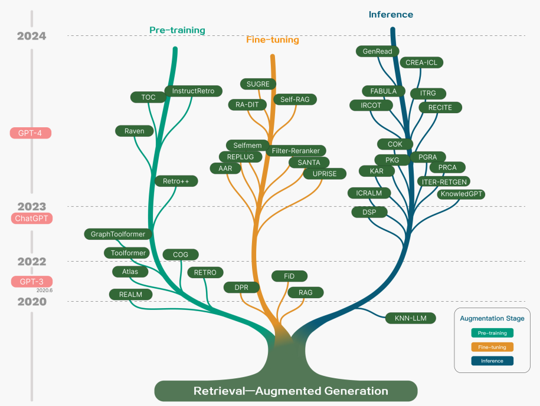
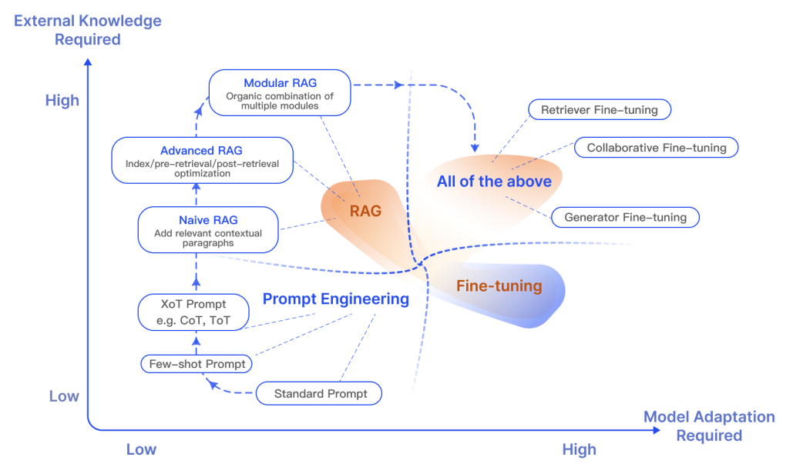
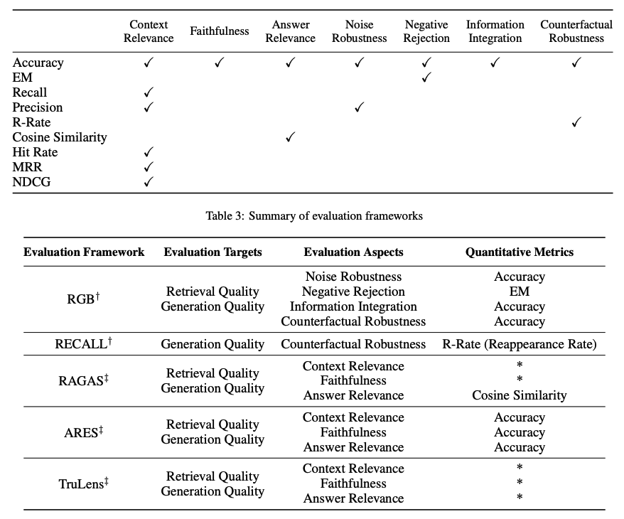

# 大语言模型的检索增强生成 (RAG) 方法

在大语言模型 (LLMs) 的应用中，我们面临众多挑战，包括领域知识的缺乏、信息的准确性问题以及生成的虚假内容。检索增强生成 (RAG) 通过引入外部知识库等额外信息源，为这些问题提供了有效的缓解策略。RAG 在那些需要不断更新知识的知识密集型场景或特定领域应用中尤为有效。与其他方法相比，RAG 的一大优势是无需针对特定任务重新训练大语言模型。近期，RAG 因其在对话助手等应用中的成功实践而广受欢迎。

本总结侧重于介绍最新调查研究《针对大语言模型的检索增强生成：一项调查》(Gao et al., 2023) 中的主要发现和实用见解。我们特别关注了现有的方法、当前最先进的 RAG 技术、评估手段、应用案例以及检索、生成和增强技术等 RAG 系统关键组成部分的相关技术。

## RAG简介

如[这里](https://www.promptingguide.ai/techniques/rag)对 RAG 的定义：

> RAG是一个将输入与一组相关的支持文档结合起来的技术，这些文档通常来自于像维基百科这样的来源。这些文档被添加到输入提示中，一起送入文本生成器，从而产生最终的输出。RAG的这一机制特别适用于需要应对信息不断更新的场景，因为大语言模型（LLM）所依赖的参数知识本质上是静态的。通过RAG，语言模型可以不经过重新训练而直接访问最新信息，以便生成可靠的、基于检索的输出。

简言之，RAG通过检索到的证据来提高LLM响应的准确性、可控性和相关性，这对于在快速变化的环境中解决问题尤其有价值，能有效减少错误信息生成和性能下降的问题。

RAG的研究不仅优化了预训练方法，还逐渐融合了RAG技术与如[ChatGPT](https://www.promptingguide.ai/models/chatgpt)和[Mixtral](https://www.promptingguide.ai/models/mixtral)这样的高性能微调模型的优势。下图展示了RAG研究的发展趋势：

下面是RAG应用的典型工作流程：

具体步骤如下：

*   **输入：** 是指LLM系统需要回答的问题。如果不使用RAG，问题直接由LLM回答。
*   **索引：** 使用RAG时，会先将相关文档分块，为这些块生成嵌入向量，并将它们索引到向量库中。在进行查询时，查询内容也会以相似的方式进行嵌入。
*   **检索：** 通过比较查询内容与索引向量，找到相关的文档。
*   **生成：** 将找到的相关文档与原始提示结合作为额外上下文，然后传递给模型进行回应生成，最终形成系统对用户的回答。

例如，直接使用模型可能因为不了解最新事件而无法回答问题。但是，通过使用RAG，系统能够提取模型回答问题所需的相关信息。

## RAG 范式的演变

近几年来，RAG（检索增强生成）系统经历了从初级阶段到高级阶段，再到模块化阶段的演变。这一进化过程旨在克服性能、成本和效率方面的挑战。

### 初级 RAG

初级 RAG 采用了一个传统过程，包括索引建立、文档检索和内容生成。简单来说，系统根据用户的输入查询相关文档，然后将这些文档和一个提示语结合起来，交给模型生成最终的回答。如果涉及到多轮对话，还可以将对话历史整合到提示语中。

初级 RAG 的局限性包括低精确度（检索到的信息不够准确）和低召回率（有时候无法检索到所有相关的信息）。此外，有时候模型可能会接收到过时的信息，这正是 RAG 系统希望首先解决的问题之一。这可能会导致模型产生不基于事实的幻想性回答，从而影响回答的准确性和可靠性。

当引入额外信息以增强回答时，还可能出现信息重复或冗余的问题。处理多个检索到的文档时，如何排列它们的优先级以及如何使生成的内容风格和语调一致也是需要考虑的挑战。我们还需要确保生成的任务不会过分依赖于这些额外信息，避免模型仅仅重复这些信息而缺乏创新。

### 高级 RAG

高级 RAG 解决了初级 RAG 面临的问题，尤其是在提高检索质量方面，包括优化检索前、检索时和检索后的各个过程。

在检索前的准备阶段，我们通过优化数据的索引建立来提高数据质量，包括改善数据的细节度、优化索引结构、添加元数据、改进对齐方式以及混合检索方法。

在检索阶段，我们可以通过改进嵌入模型来提高上下文片段的质量。例如，通过对嵌入模型进行微调，以提高检索的相关性，或者使用能够更好理解上下文的动态嵌入模型（如 OpenAI 的 embeddings-ada-02 模型）。

在检索后的优化过程中，我们专注于解决上下文窗口限制和减少噪音或分散注意力的信息。常用的方法包括重新排列文档，以将更相关的内容放在提示的前后，或者重新计算查询与文档片段之间的语义相似度。此外，通过压缩提示信息也有助于解决这些问题。

### 模块化的 RAG 介绍

模块化 RAG，顾名思义，通过增强其功能模块来提升性能，例如加入相似性检索的搜索模块，以及在检索工具上进行精细调整。模块化 RAG 能够根据具体的任务需求，添加、替换或调整模块之间的工作流程，从而实现更高的多样性和灵活性。这种设计让模块化 RAG 不仅包括了朴素 RAG 和高级 RAG 这两种固定模式，还扩展了包括搜索、记忆、融合、路由、预测和任务适配等多种模块，以解决各种问题。

随着 RAG 系统构建变得更加灵活，一系列优化技术相继被提出，用于进一步优化 RAG 流程，包括：

- **混合式搜索探索：** 结合了关键词搜索与语义搜索等多种搜索技术，以便检索到既相关又富含上下文的信息，特别适用于处理多样化的查询类型和信息需求。
- **递归式检索与查询引擎：** 通过从小的语义片段开始，逐步检索更大的内容块以丰富上下文的递归过程，有效平衡了检索效率与信息的丰富度。
- **StepBack-prompt 提示技术：** 一种特殊的提示方法，能让大语言模型进行概念和原则的抽象化处理，从而引导更加深入的推理过程。当应用于 RAG 框架时，能够帮助模型超越具体事例，进行更广泛的推理。
- **子查询策略：** 采用树状查询或按序查询小块信息的不同策略，适用于多种场景。LlamaIndex 提供的子问题查询引擎允许将大的查询任务拆分成多个小问题，分别利用不同的数据源进行解答。
- **假设性文档嵌入技术 (HyDE)：** 通过生成查询的假设性回答并嵌入，来检索与这个假设回答相似的文档，而不是直接使用查询本身，以此来优化检索效果。

## RAG框架简述

在这一部分，我们将概述 RAG 系统的核心组成部分，包括检索、生成和增强三大环节的最新进展。这些组件共同构成了 RAG 的基础，使其能够有效处理各种信息检索和内容生成的任务，进而提升系统的整体性能和应用灵活性。

### 检索技术

在RAG系统中，检索是关键环节，负责从大数据中找出最有价值的信息。我们可以通过多种方法提升检索器的效能，包括：

**提升语义理解**

改善检索器背后的语义理解能力至关重要。这里有一些改进策略：

*   **数据分块策略：** 确定合适的数据分块方式非常关键，这依赖于你的数据内容和应用需求。例如，针对单句效果更佳的句子转换器，与处理256或512个词元的文本时，使用文本嵌入-ada-002模型会更加出色。此外，还需考虑用户提问的长度、应用需求和词元数量上限。实际应用中，通过尝试不同的数据分块策略来发现最优的检索效率是常见做法。
*   **专业领域的嵌入模型微调：** 确定了有效的数据分块策略后，如果你的工作聚焦于特定领域，可能还需要对嵌入模型进行微调。否则，可能会导致系统无法正确理解用户查询。可针对广泛的领域知识或特定的下游任务进行微调。例如，[BGE-large-EN 开发的 BAAI](https://github.com/FlagOpen/FlagEmbedding) 模型，就能通过微调来提高检索的相关性。

**查询与文档的精准匹配**

确保用户查询与数据库中文档的匹配度，特别是在查询可能缺少具体语义信息或措辞不够精确的情况下，显得尤为重要。实现这一目标的方法包括：

*   **查询重写：** 通过多种技术改写查询，以提高匹配的准确性，例如利用Query2Doc、ITER-RETGEN和HyDE等工具。
*   **查询嵌入的优化：** 通过调整查询的嵌入表示，使其更好地与任务相关的潜在空间对齐，从而提升查询效果。

**检索器与大语言模型的协同优化**

此外，还需要确保检索器产出的结果与大语言模型(LLM)的预期一致，以实现最佳的协同工作效果。

* **优化检索技术:** 通过分析大语言模型(LLM)提供的反馈，进一步完善检索系统。例如，通过适应性增强检索技术([AAR](https://arxiv.org/abs/2305.17331))，[REPLUG](https://arxiv.org/abs/2301.12652)，和[UPRISE](https://arxiv.org/abs/2303.08518)等方式来实现。
* **引入辅助工具:** 通过加入外部工具，如[PRCA](https://aclanthology.org/2023.emnlp-main.326/)，[RECOMP](https://arxiv.org/abs/2310.04408)，和[PKG](https://arxiv.org/abs/2305.04757)，辅助优化信息对齐过程。

### 文本生成

在RAG系统中，负责将检索到的信息转化为流畅文本的生成器扮演着关键角色，该文本将成为模型输出的最终成果。这个转换过程涉及到复杂多变的输入信息，有时候需要特别努力来调整语言模型以更好地适应从查询和文档中得到的输入数据。这一挑战可以通过后期检索处理和模型微调来克服：

* **检索后处理与模型固定:** 在保持大语言模型(LLM)不变的情况下，通过后处理技术改善检索结果的质量，如通过信息简化和结果优先排序等手段。信息简化有助于减少冗余信息，解决模型处理长文本的限制，并提升最终文本的生成质量。优先排序则是将最相关的信息排在前面，以提高检索的准确性。
* **针对RAG系统的LLM微调:** 为了提高RAG系统的效率，可以对生成文本的过程进行细致调整或微调，确保生成的文本既自然流畅又能有效地结合检索到的文档信息。

### 增强技术简介

增强技术指的是将检索到的信息内容有效融入当前任务生成过程的方法。在深入探讨增强技术的过程、阶段及数据之前，先来看一下 RAG（检索增强生成模型）的核心组成部分分类：

在预训练、微调和推理等多个阶段，都可以应用检索增强技术。

*   **增强阶段：** [RETRO](https://arxiv.org/abs/2112.04426) 示例展示了如何从零开始利用检索增强进行大规模预训练；它额外引入了一个基于外部知识构建的编码器。此外，通过结合 RAG 进行微调，可以进一步提升系统的性能。在推理阶段，根据具体任务需求采取多种技术将检索内容有效融入，以优化 RAG 的应用效果。

*   **增强数据源：** 选择何种增强数据对 RAG 模型的效果影响极大。数据源主要分为三类：非结构化数据、结构化数据以及由大语言模型生成的数据。

*   **增强过程：** 对于一些需要多步骤推理的问题，单次检索可能不足以解决，因此提出了以下几种方法：
    *   **迭代检索**：模型通过多轮检索，不断深化和丰富信息内容。例如，[RETRO](https://arxiv.org/abs/2112.04426) 和 [GAR-meets-RAG](https://arxiv.org/abs/2310.20158) 就是采用这种方法。
    *   **递归检索**：在这种方法中，一次检索的输出成为另一次检索的输入，逐步深入挖掘复杂查询的相关信息，适用于学术研究和法律案例分析等场景。著名实践包括 [IRCoT](https://arxiv.org/abs/2212.10509) 和 [Tree of Clarifications](https://arxiv.org/abs/2310.14696)。
    *   **自适应检索**：根据特定需求调整检索过程，选择最合适的时机和内容进行检索，以达到最佳效果。这种方法的代表性研究包括 [FLARE](https://arxiv.org/abs/2305.06983) 和 [Self-RAG](https://arxiv.org/abs/2310.11511)。

下图详细描绘了 RAG 研究的不同增强方面，涵盖了增强的阶段、数据源和具体过程。

### RAG 与 微调的区别

RAG 和微调之间的差异，以及它们各自适用的场景，一直是热门话题。研究显示，RAG 特别适合于融合新知识，而微调则能够通过优化模型内部知识、输出格式以及提升复杂指令的执行能力，来增强模型的性能和效率。这两种方法可以相辅相成，共同推动大语言模型在处理复杂的知识密集型任务和需要快速适应新知识、定制化反馈（遵循特定格式、语调和风格）的可扩展应用中的使用。另外，提示工程（Prompting Engineering）通过发挥模型本身的优势，也能在优化结果方面发挥作用。下面这张图表展示了RAG在与其他模型优化方法相比时的独特特性：

下表来自一篇综述文章，对比了RAG和经过微调的模型的特点：

## RAG 模型评估解析

就像衡量大语言模型（LLM）在不同维度的表现一样，评估对于深入理解和提升 RAG（检索增强生成）模型在各种应用场景下的性能至关重要。传统上，人们通过特定任务的指标，如 F1 分数和准确率（EM），来评价 RAG 系统在下游任务上的表现。例如，[RaLLe](https://arxiv.org/abs/2308.10633v2) 就是一个评估知识密集型任务中检索增强型大语言模型性能的著名框架。

在 RAG 模型的评估中，我们既关注检索的内容质量，也关注生成的文本质量。为了评估检索的效果，我们采用了推荐系统和信息检索等知识密集领域的评估指标，比如归一化折扣累计增益（NDCG）和命中率。而在生成质量的评估上，可以从相关性、有害内容的筛选（对未标记内容）或准确性（对已标记内容）等不同维度进行考量。整体上，RAG 模型的评估可以采用手动或自动的方法进行。

具体来说，RAG 框架的评估着眼于三个主要质量指标和四大能力。这三个质量指标包括：上下文相关性（即检索到的信息的精确度和相关度）、答案忠实度（即答案对于检索到的上下文的忠实反映）、以及答案相关性（即答案与提出的问题的契合度）。此外，还有四项能力评估 RAG 系统的适应性和效率，包括：对噪声的鲁棒性、负面信息的排除、信息整合能力和面对假设情况的鲁棒性。下面是一个评估 RAG 系统不同方面所用指标的概览：

为了全面评估 RAG 模型的性能，人们使用了如 [RGB](https://arxiv.org/abs/2309.01431) 和 [RECALL](https://arxiv.org/abs/2311.08147) 等多个基准测试。同时，开发了如 [RAGAS](https://arxiv.org/abs/2309.15217)、[ARES](https://arxiv.org/abs/2311.09476) 和 [TruLens](https://www.trulens.org/trulens_eval/core_concepts_rag_triad/) 等多种工具，以自动化 RAG 系统评估流程。一些系统还利用大语言模型来确定上述某些质量指标。

## RAG 研究的挑战与前景

我们在这次概述中讨论了 RAG 研究的多个方面，以及如何通过不同的方法来增强检索、补充和生成过程。以下是 [Gao et al., 2023](https://arxiv.org/abs/2312.10997) 强调的，随着我们不断开发和完善 RAG 系统，将会面临的几个关键挑战：

*   **上下文长度问题：** 随着大语言模型不断扩大其处理的上下文范围，我们需要对 RAG 进行调整，以确保它能够有效捕获到最相关和关键的上下文信息。
*   **系统的鲁棒性：** 如何处理与现实相反的信息和对抗性信息，对于提高 RAG 的性能至关重要。
*   **混合方法的探索：** 目前，研究者正在努力更好地理解如何将 RAG 与专门调整过的模型结合使用，以实现最佳效果。
*   **扩展大语言模型的作用：** 如何进一步提升大语言模型在 RAG 系统中的作用和能力，是一个高度关注的领域。
*   **规模化法则的探究：** 大语言模型的规模化法则及其在 RAG 系统中的应用仍然是一个未完全解决的问题。
*   **生产级 RAG 的挑战：** 要实现可投入生产使用的 RAG 系统，需要在性能、效率、数据安全性、隐私保护等方面达到工程上的卓越。
*   **多模态 RAG 的发展：** 尽管已有大量研究集中于文本任务的 RAG 系统，但现在我们正开始探索如何将 RAG 应用到更多领域，比如图像、音频、视频和编码等。
*   **评价机制的完善：** 随着 RAG 被用于构建更为复杂的应用，开发能够细致评估上下文相关性、创新性、内容多样性、准确性等方面的评价工具变得尤为重要。此外，提高对 RAG 的解释性研究和工具开发也是必要的。

## 构建 RAG 系统的工具

构建 RAG 系统时，可以选择多种综合工具，如 LangChain、LlamaIndex 和 DSPy，这些工具提供了强大的功能来支持不同的需求。此外，还有一些专门的工具，比如 Flowise AI，它提供了一个低代码平台，使得构建 RAG 应用变得更加简单。其他值得关注的技术还包括 HayStack、Meltano 和 Cohere Coral 等，这些技术为特定的需求提供了解决方案。同时，一些软件和云服务提供商也开始提供以 RAG 为中心的服务，例如 Weaviate 的 Verba 适合构建个人助理应用，而亚马逊的 Kendra 则提供智能企业搜索服务。

这些工具和服务的开发，不仅推动了 RAG 技术的应用范围扩展，也为研究人员和开发者提供了更多的可能性，使他们能够更容易地探索和实现复杂的 RAG 应用。随着技术的不断进步，我们期待看到更多创新的应用出现，为用户带来更加丰富和深入的交互体验。

## 结论

在总结中，我们看到了 RAG（检索增强生成）系统的快速进步，这包括了能够定制并推动 RAG 在多个领域性能和实用性进一步提高的先进范式的开发。RAG 应用的需求极为旺盛，这促使了对于改进 RAG 系统各个组件的方法的快速发展。无论是融合不同技术的方法还是自我检索技术，这些都是目前 RAG 模型研究中正在探索的领域。对于更优秀的评估工具和衡量指标的需求也在不断增长。下图为我们提供了一个关于 RAG 生态系统、提升 RAG 性能的技术、面临的挑战及本综述讨论的其他相关内容的概览：

***

*图片来源：[为大语言模型增强检索生成：一项调查](https://arxiv.org/abs/2312.10997)*

## RAG 研究见解

这里列出了一些重要的研究论文，它们揭示了 RAG 领域的关键洞察和最新进展。

| **洞见**  | **参考来源** | **发布日期** |
| ------------- | ------------- | ------------- |
| 提出一种名为纠正检索增强生成（CRAG, Corrective Retrieval Augmented Generation）的方法，旨在提升 RAG 系统生成内容的稳定性和准确性。其核心在于增加一个能够自我修正的组件至检索器中，并优化检索文档的使用，以促进更优质的内容生成。此外，引入了一种检索评估机制，用于评价针对特定查询检索到的文档的整体品质。通过网络搜索和知识的优化利用，能够有效提升文档自我修正和利用的效率。 | [纠正检索增强生成](https://arxiv.org/abs/2401.15884)| 2024年1月|
| RAPTOR 模型通过递归方式嵌入、聚类并总结文本信息，自底向上构建出层次化的总结树。在使用时，该模型能够从这棵树中检索信息，实现对长文档在不同抽象层面上信息的综合利用。 | [RAPTOR：递归抽象处理用于树组织检索](https://arxiv.org/abs/2401.18059)| 2024年1月 |
| 开发了一个通用框架，通过大语言模型（LLM）与检索器之间的多步骤互动，有效处理多标签分类难题。 | [在上下文中学习用于极端多标签分类](https://arxiv.org/abs/2401.12178) | 2024年1月 |
| 研究表明，通过提取高资源语言中语义相似的提示，可以显著提升多语言预训练语言模型在多种任务上的零样本学习能力。 | [从分类到生成：洞察跨语言检索增强的 ICL](https://arxiv.org/abs/2311.06595) | 2023年11月|
| 针对 RAGs 模型在处理噪声较多、不相关文档以及未知情境时的稳健性进行了改善，通过为检索文档生成序列化阅读笔记，深入评估其与提问的相关性，并整合信息以构建最终答案。 | [链式笔记：增强检索增强语言模型的鲁棒性](https://arxiv.org/abs/2311.09210)| 2023年11月 |
| 通过去除可能不会对答案生成贡献关键信息的标记，优化了检索增强阅读模型的处理流程，实现了高达 62.2% 的运行时间缩减，同时保持性能仅降低了2%。 | [通过标记消除优化检索增强阅读器模型](https://arxiv.org/abs/2310.13682)|  | 2023年10月 |
| 通过对小型语言模型 (LM) 进行指令式微调，我们开发了一个独立的验证器，以验证知识增强语言模型 (knowledge-augmented LMs) 的输出及其知识准确性。这种方法特别有助于解决模型在面对特定查询时未能检索相关知识，或在生成文本中未能准确反映检索到的知识的情况。 | [知识增强语言模型验证](https://arxiv.org/abs/2310.12836) | 2023年10月 |
| 我们设立了一个基准测试，以分析不同大型语言模型 (LLMs) 在检索增强生成 (RAG) 所需的四项核心能力——噪声容忍、排除不相关信息、信息融合和对反事实情境的适应性——的表现。 | [大型语言模型在检索增强生成中的基准测试](https://arxiv.org/abs/2309.01431) | 2023年10月 |
| 介绍了一种自我反思的检索增强生成 (Self-RAG) 框架，旨在通过检索和自我反思来提升语言模型的质量和事实性。该框架利用语言模型动态检索信息，并通过反思标记来生成和评估检索到的内容及其自生成内容。 | [自我反思检索增强生成: 通过自我反思学习检索、生成及自我批判](https://arxiv.org/abs/2310.11511) | 2023年10月 |
| 通过生成增强检索 (GAR) 和检索增强生成 (RAG) 的迭代改善，提高了零样本信息检索的能力。该过程中的改写-检索阶段有效提升了召回率，而重排阶段则显著提高了精度。 | [零样本信息检索中的GAR与RAG相结合的新范式](https://arxiv.org/abs/2310.20158) | 2023年10月 |
| 通过使用基于 43B GPT 模型的预训练和从 1.2 万亿 Token 中检索信息，我们预训练了一个 48B 的检索模型。进一步通过指令式微调，该模型在多种零样本任务上相比经过指令式微调的 GPT 模型显示出显著的性能提升。 | [InstructRetro: 检索增强预训练后的指令式微调](https://arxiv.org/abs/2310.07713) | 2023年10月|
| 通过两步精细调整，我们为大型语言模型增加了检索功能：一步是优化预训练的语言模型以更有效利用检索到的信息，另一步则是改进检索器以返回更符合语言模型偏好的相关结果。这种分阶段的微调方法，在要求知识利用和上下文感知的任务中，显著提升了性能。 | [检索增强的双重指令微调 (RA-DIT)](https://arxiv.org/abs/2310.01352) | 2023年10月 |
| 介绍了一种提升 RAGs 在面对不相关内容时鲁棒性的方法。该方法通过在训练期间混合使用相关与不相关的上下文，自动产生数据以微调语言模型，从而有效利用检索到的文段。 | [让基于检索增强的语言模型对无关上下文更加鲁棒](https://arxiv.org/abs/2310.01558) |2023年10月|
| 研究表明，采用简单检索增强技术的 4K 上下文窗口的大语言模型在生成过程中，其表现与通过位置插值对长上下文任务进行微调的 16K 上下文窗口的大语言模型相媲美。 | [当检索遇上长上下文的大语言模型](https://arxiv.org/abs/2310.03025)| 2023年10月|
| 在上下文融合前将检索文档压缩为文本摘要，既降低了计算成本，也减轻了模型从长文档中识别关键信息的难度。 | [RECOMP: 用压缩和选择性增强提升检索增强语言模型](https://arxiv.org/abs/2310.04408)| 2023年10月|
| 提出了一个迭代式的检索与生成协同工作框架，它结合了参数化和非参数化知识，通过检索与生成的互动来寻找正确的推理路径。这一框架特别适合需要多步推理的任务，能够显著提高大语言模型的推理能力。 | [检索与生成的协同作用加强了大语言模型的推理能力](https://arxiv.org/abs/2310.05149)| 2023年10月|
| 提出“澄清树”框架，该框架通过少样本提示并借助外部知识，为含糊问题递归构建一个消歧树。然后利用这棵树产生详细的答案。 | [利用检索增强大语言模型回答含糊问题的“澄清树”方法](https://arxiv.org/abs/2310.14696) | 2023年10月 |
| 介绍了一种使大语言模型能够参考其之前遇到的问题，并在面对新问题时动态调用外部资源的方法。 | [借助自我知识的大语言模型检索增强策略](https://arxiv.org/abs/2310.05002)| 2023年10月|
| 提供了一组评估指标，用于从多个维度（如检索系统识别相关及集中上下文段落的能力、大语言模型忠实利用这些段落的能力，以及生成内容本身的质量）评价不同方面，而无需依赖人工注释的真实数据。| [RAGAS: 对检索增强生成进行自动化评估的指标体系](https://arxiv.org/abs/2309.15217) | 2023年9月 |
| 提出了一种创新方法——生成后阅读（GenRead），它让大型语言模型先根据提问生成相关文档，再从这些文档中提取答案。 | [生成而非检索：大型语言模型作为强大的上下文生成器](https://arxiv.org/abs/2209.10063)| 2023年9月 |
| 展示了在 RAG 系统中如何使用特定排名器（比如 DiversityRanker 和 LostInTheMiddleRanker）来挑选信息，从而更好地利用大型语言模型的上下文窗口。 | [提升 Haystack 中 RAG 系统的能力：DiversityRanker 和 LostInTheMiddleRanker 的引入](https://towardsdatascience.com/enhancing-rag-pipelines-in-haystack-45f14e2bc9f5) | 2023年8月 |
| 描述了如何将大型语言模型与不同的知识库结合，以便于知识的检索和储存。通过编程思维的提示来生成知识库的搜索代码，此外，还能够根据用户的需要，将知识储存在个性化的知识库中。 | [KnowledGPT: 利用知识库检索和存储功能增强大型语言模型](https://arxiv.org/abs/2308.11761) | 2023年8月|
| 提出一种模型，通过结合检索增强掩码语言建模和前缀语言建模，引入上下文融合学习，以此提高少样本学习的效果，使模型能够在不增加训练负担的情况下使用更多上下文示例。 | [RAVEN: 借助检索增强编解码器语言模型实现的上下文学习](https://arxiv.org/abs/2308.07922)| 2023年8月|
| RaLLe 是一款开源工具，专门用于开发、评估和提升针对知识密集型任务的 RAG 系统的性能。 | [RaLLe: 针对检索增强大型语言模型的开发和评估框架](https://arxiv.org/abs/2308.10633) | 2023年8月|
| 研究发现，当相关信息的位置发生变化时，大型语言模型的性能会明显受影响，这揭示了大型语言模型在处理长篇上下文信息时的局限性。 | [中途迷失：大型语言模型处理长篇上下文的方式](https://arxiv.org/abs/2307.03172) | 2023年7月 |
| 通过迭代的方式，模型能够将检索和生成过程相互协同。模型的输出不仅展示了完成任务所需的内容，还为检索更多相关知识提供了丰富的上下文，从而在下一轮迭代中帮助产生更优的结果。 | [通过迭代检索-生成协同增强检索增强的大语言模型](https://arxiv.org/abs/2305.15294) | 2023年5月|
| 介绍了一种新的视角，即在文本生成过程中，系统能够主动决定何时以及检索什么信息。接着，提出了一种名为FLARE的方法，通过预测下一句话来预见未来的内容，利用此内容作为关键词检索相关文档，并在发现不确定的表达时重新生成句子。 | [主动检索增强生成](https://arxiv.org/abs/2305.06983)| 2023年5月|
| 提出了一个能够通用应用于各种大语言模型的检索插件，即使在模型未知或不能共同微调的情况下也能提升模型性能。 | [适应增强型检索器改善大语言模型的泛化作为通用插件](https://arxiv.org/abs/2305.17331)| 2023年5月|
| 通过两种创新的预训练方法，提高了对结构化数据的密集检索效果。首先，通过对结构化数据和非结构化数据之间的关联进行预训练来提升模型的结构感知能力；其次，通过实现遮蔽实体预测来更好地捕捉结构语义。 | [结构感知的语言模型预训练改善结构化数据上的密集检索](https://arxiv.org/abs/2305.19912) | 2023年5月 |
| 该框架能够动态地融合来自不同领域的多样化信息源，以提高大语言模型的事实准确性。通过一个自适应的查询生成器，根据不同知识源定制查询，确保信息的准确性逐步得到修正，避免错误信息的累积和传播。 | [知识链：通过动态知识适应异质来源来基础大语言模型](https://arxiv.org/abs/2305.13269) | 2023年5月 |
| 此框架通过首先检索知识图谱中的相关子图，并通过调整检索到的子图的词嵌入来确保事实的一致性，然后利用对比学习确保生成的对话与知识图谱高度一致，为生成与上下文相关且基于知识的对话提供了新方法。 | [用于知识基础对话生成的知识图谱增强大语言模型](https://arxiv.org/abs/2305.18846)| 2023年5月|
| 通过采用小型语言模型作为可训练重写器，以适应黑盒式大语言模型（LLM）的需求。重写器通过强化学习（RL）根据 LLM 的反馈进行训练，从而构建了一个名为“重写-检索-阅读”的新框架，专注于查询优化。| [为检索增强的大语言模型重写查询](https://arxiv.org/abs/2305.14283)| 2023年5月 |
| 利用检索增强生成器迭代创建无限记忆池，并通过记忆选择器挑选出适合下一轮生成的记忆。此方法允许模型利用自身产出的记忆，称为“自我记忆”，以提升内容生成质量。| [自我提升：带有自我记忆的检索增强文本生成](https://arxiv.org/abs/2305.02437) | 2023年5月 |
| 通过为大语言模型（LLM）装配知识引导模块，让它们在不改变内部参数的情况下，获取相关知识。这一策略显著提高了模型在需要丰富知识的领域任务（如事实知识增加7.9%，表格知识增加11.9%，医学知识增加3.0%，多模态知识增加8.1%）的表现。| [用参数知识引导增强大语言模型](https://arxiv.org/abs/2305.04757) | 2023年5月|
| 为大语言模型（LLM）引入了一个通用的读写记忆单元，允许它们根据任务需要从文本中提取、存储并回忆知识。| [RET-LLM：朝向大语言模型的通用读写记忆](https://arxiv.org/abs/2305.14322) | 2023年5月|
| 通过使用任务不可知检索器，构建了一个共享静态索引，有效选出候选证据。随后，设计了一个基于提示的重排机制，根据任务的特定相关性重新排序最相关的证据，为读者提供精准信息。| [针对非知识密集型任务的提示引导检索增强](https://arxiv.org/abs/2305.17653)| 2023年5月|
| 提出了UPRISE（通用提示检索以改善零样本评估），通过调整一个轻量级且多功能的检索器，它能自动为给定零样本任务的输入检索出最合适的提示，以此来改善评估效果。| [UPRISE：改进零样本评估的通用提示检索](https://arxiv.org/abs/2303.08518) | 2023年3月 |
| 结合了 SLMs 作为过滤器和 LLMs 作为重排器的优势，提出了一个适应性的“过滤-再重排”范式，有效提升了难样本的信息提取与重排效果。| [大语言模型不是一个理想的少样本信息提取器，但它在重排难样本方面表现出色！](https://arxiv.org/abs/2303.08559) | 2023年3月 |
零样本学习指导一款能够遵循指令的大语言模型，创建一个虚拟文档来抓住重要的联系模式。接着，一个名为Contriever的工具会将这份文档转化成嵌入向量，利用这个向量在大数据集的嵌入空间中找到相似文档的聚集地，通过向量的相似度来检索真实文档。 | [无需相关标签的精确零样本密集检索](https://arxiv.org/abs/2212.10496) | 2022年12月 |
提出了一个名为展示-搜索-预测（DSP）的新框架，通过这个框架可以编写高级程序，这些程序能够先展示流程，然后搜索相关信息，并基于这些信息做出预测。它能够将复杂问题分解成小的、更易于解决的步骤。 | [通过检索和语言模型组合，为复杂的自然语言处理任务提供解决方案](https://arxiv.org/abs/2212.14024) | 2022年12月 |
采用了一种新的多步骤问答策略，通过在思维链条的每一步中穿插检索信息，使用检索到的信息来丰富和改善思维链条。这种方法显著提升了解决知识密集型多步问题的效果。 | [结合思维链条推理和信息检索解决复杂多步骤问题](https://arxiv.org/abs/2212.10509) | 2022年12月 |
研究发现，增加检索环节可以有效减轻对已有训练信息的依赖，使得RAG变成一个有效捕捉信息长尾的策略。 | [大语言模型在学习长尾知识方面的挑战](https://arxiv.org/abs/2211.08411) | 2022年11月 |
通过抽样方式，从大语言模型的记忆中提取相关信息段落，进而生成最终答案。 | [通过回忆增强语言模型的能力](https://arxiv.org/abs/2210.01296) | 2022年10月 |
将大语言模型用作少量示例的查询生成器，根据这些生成的数据构建针对特定任务的检索系统。 | [Promptagator: 基于少量示例实现密集检索](https://arxiv.org/abs/2209.11755) | 2022年9月 |
介绍了Atlas，这是一个经过预训练的检索增强型语言模型，它能够通过极少数的示例学习掌握知识密集任务。 |[Atlas: 借助检索增强型语言模型进行少样本学习](https://arxiv.org/abs/2208.03299)| 2022年8月 |
通过从训练数据中进行智能检索，实现了在多个自然语言生成和理解任务上的性能提升。 | [重新认识训练数据的价值：通过训练数据检索的简单有效方法](https://arxiv.org/abs/2203.08773) | 2022年3月 |
通过在连续的数据存储条目之间建立指针关联，并将这些条目分组成不同的状态，我们近似模拟了数据存储搜索过程。这种方法创造了一个加权有限自动机，在推理时能够在不降低模型预测准确性（困惑度）的情况下，节约高达 83% 的查找最近邻居的计算量。 | [通过自动机增强检索的神经符号语言建模](https://arxiv.org/abs/2201.12431) | 2022 年 1 月 |
通过将自回归语言模型与从大规模文本库中检索的文档块相结合，基于这些文档与前文 Token 的局部相似性，我们实现了模型的显著改进。该策略利用了一个庞大的数据库（2 万亿 Token），大大增强了语言模型的能力。 | [通过从数万亿 Token 中检索来改善语言模型](https://arxiv.org/abs/2112.04426) | 2021 年 12 月 |
我们采用了一种创新的零样本任务处理方法，通过为检索增强生成模型引入严格的负样本和强化训练流程，提升了密集段落检索的效果，用于零样本槽填充任务。 | [用于零样本槽填充的鲁棒检索增强生成](https://arxiv.org/abs/2108.13934)| 2021 年 8 月 |
介绍了 RAG 模型，这是一种结合了预训练的 seq2seq 模型（作为参数记忆）和基于密集向量索引的 Wikipedia（作为非参数记忆）的模型。此模型通过预训练的神经网络检索器访问信息，比较了两种 RAG 设计：一种是在生成过程中始终依赖相同检索的段落，另一种则是每个 Token 都使用不同的段落。 | [用于知识密集型 NLP 任务的检索增强生成](https://arxiv.org/abs/2005.11401) | 2020 年 5 月 |
展示了一种仅通过密集表示实现信息检索的方法，该方法通过简单的双编码框架从少量问题和文本段落中学习嵌入。这种方法为开放域问答提供了一种高效的密集段落检索方案。 | [用于开放域问答的密集段落检索](https://arxiv.org/abs/2004.04906)| 2020 年 4 月 |

## 参考资料

*   [探索大语言模型中幻觉现象：从原理到挑战的全方位解析](https://arxiv.org/abs/2311.05232)
*   [知识密集型任务下的检索增强式文本生成新策略](https://arxiv.org/abs/2005.11401)
*   [融合检索的多模态语言模型创新](https://arxiv.org/abs/2211.12561)
*   [如何通过上下文增强检索改进语言模型](https://arxiv.org/abs/2302.00083)
*   [实现精确零样本检索的新方法：无需人工标注](https://arxiv.org/abs/2212.10496)
*   [预训练自回归语言模型的新思路：检索的力量](https://arxiv.org/pdf/2312.10997.pdf)
*   [REPLUG：采用检索增强机制的语言模型革新](https://arxiv.org/abs/2301.12652)
*   [Query2Doc：从查询到文档的智能转换](https://arxiv.org/abs/2303.07678)
*   [ITER-RETGEN：迭代检索与生成的结合](https://arxiv.org/abs/2305.15294)
*   [大语言模型性能提升的策略与技巧综述](https://youtu.be/ahnGLM-RC1Y?si=z45qrLTPBfMe15LM)
*   [HyDE：深入探索高效检索模型](https://arxiv.org/abs/2212.10496)
*   [RAG技术进阶：直观图解与案例分析](https://pub.towardsai.net/advanced-rag-techniques-an-illustrated-overview-04d193d8fec6)
*   [RAG应用评估的最佳实践：大语言模型的新视角](https://www.databricks.com/blog/LLM-auto-eval-best-practices-RAG)
*   [构建符合生产标准的RAG应用：实践指南](https://youtu.be/TRjq7t2Ms5I?si=gywRj82NIc-wsHcF)
*   [深度解析文档检索评估：RAG评估指南第一篇](https://www.deepset.ai/blog/rag-evaluation-retrieval)
*   [超越RAG：融合互惠排名与查询生成的未来趋势](https://towardsdatascience.com/forget-rag-the-future-is-rag-fusion-1147298d8ad1)
