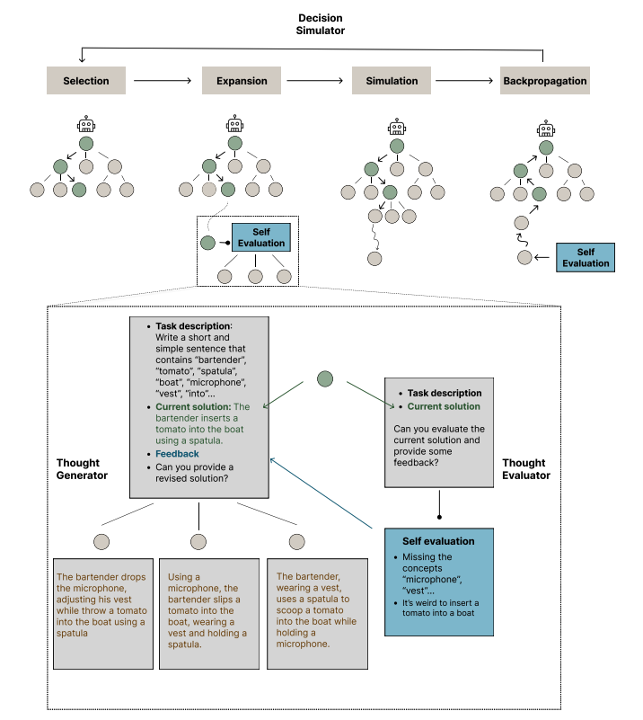

# 以中介修正與搜尋提升 LLM 推理能力

import {Bleed} from 'nextra-theme-docs'

<iframe width="100%"
  height="415px"
  src="https://www.youtube.com/embed/13fr5m6ezOM?si=DH3XYfzbMsg9aeIx" allow="accelerometer; autoplay; clipboard-write; encrypted-media; gyroscope; picture-in-picture"
  allowFullScreen
  />

[Chi et al. (2024)](https://arxiv.org/abs/2404.05966) 在這篇工作中，提出一種適用於可拆解任務的一般化推理與搜尋框架。

他們設計了一個圖結構的框架 THOUGHTSCULPT，將「反覆自我修正的能力」整合進 LLM 推理過程，讓模型可以在圖狀空間中構築與探索一張交織的「思考網路」。

與 Tree-of-Thoughts 等以樹狀結構來約束推理過程的方法不同，THOUGHTSCULPT 將 Monte Carlo Tree Search（MCTS）融入框架中，利用搜尋演算法更有效率地在思考空間中導引路徑。

這個方法由三個主要元件構成：

1. **思考評估器（thought evaluator）：**
   由 LLM 驅動，用來評估目前候選區域性解的品質，並給出回饋分數。

2. **思考產生器（thought generator）：**
   同樣由 LLM 驅動，根據目前狀態產生新的候選解或推理步驟。

3. **決策模擬器（decision simulator）：**
   作為 MCTS 流程的一部分，模擬連續的思考路徑，評估其潛在價值，再將結果回饋給搜尋策略。

透過「不斷修正目前思路」與「在圖結構中搜尋更佳路徑」，THOUGHTSCULPT 特別適合：

- 開放式產生任務
- 多步驟推理問題
- 需要創意發想與多樣候選解的場景

未來可以預期會有更多方法，結合類似的搜尋演算法與 LLM 推理能力，來處理需要高度推理與規劃的複雜任務。這篇論文是觀察此一研究方向的重要參考作品。

