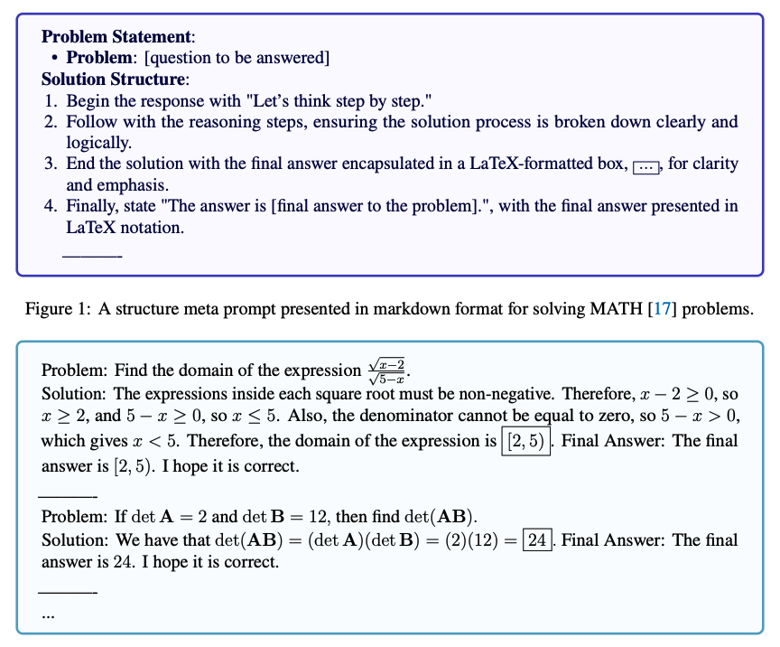

# Meta Prompting
import { Callout } from 'nextra/components'

## Introduction

Meta Prompting is an advanced prompting technique that focuses on the structural and syntactical aspects of tasks and problems rather than their specific content details. This goal with meta prompting is to construct a more abstract, structured way of interacting with large language models (LLMs), emphasizing the form and pattern of information over traditional content-centric methods.

## Key Characteristics

According to [Zhang et al. (2024)](https://arxiv.org/abs/2311.11482), the key characteristics of meta prompting can be summarized as follows:

**1. Structure-oriented**: Prioritizes the format and pattern of problems and solutions over specific content.

**2. Syntax-focused**: Uses syntax as a guiding template for the expected response or solution.

**3. Abstract examples**: Employs abstracted examples as frameworks, illustrating the structure of problems and solutions without focusing on specific details.

**4. Versatile**: Applicable across various domains, capable of providing structured responses to a wide range of problems.

**5. Categorical approach**: Draws from type theory to emphasize the categorization and logical arrangement of components in a prompt.

## Advantages over Few-Shot Prompting

[Zhang et al., 2024](https://arxiv.org/abs/2311.11482) report that meta prompting and few-shot prompting are different in that it meta prompting focuses on a more structure-oriented approach as opposed to a content-driven approach which few-shot prompting emphasizes. 

The following example obtained from [Zhang et al. (2024)](https://arxiv.org/abs/2311.11482) demonstrates the difference between a structured meta prompt and a few-shot prompt for solving problems from the MATH benchmark:

The advantages of Meta Prompting over few-shot promoting include:

**1. Token efficiency**: Reduces the number of tokens required by focusing on structure rather than detailed content.

**2. Fair comparison**: Provides a more fair approach for comparing different problem-solving models by minimizing the influence of specific examples.

**3. Zero-shot efficacy**: Can be viewed as a form of zero-shot prompting, where the influence of specific examples is minimized.

<Callout type= "info" emoji="🎓">
Learn more about Meta Prompting and advanced prompting methods in our new AI courses. [Join now!](https://dair-ai.thinkific.com/)
Use code PROMPTING20 to get an extra 20% off.
</Callout>

## Applications

By focusing on the structural patterns of problem-solving, Meta Prompting offers a clear roadmap for navigating complex topics, enhancing the reasoning capabilities of LLMs across various domains.

It's important to note that meta prompting also assumes that the LLM has innate knowledge about the specific task or problem being addressed. As LLMs can generalize to a unseen tasks, it is possible that they can be leveraged with meta prompting but performance might deteriorate with more unique and novel tasks as is the case with zero-shot prompting. 

Applications where meta prompting can be beneficial include but not limited to complex reasoning tasks, mathematical problem-solving, coding challenges, theoretical queries.

