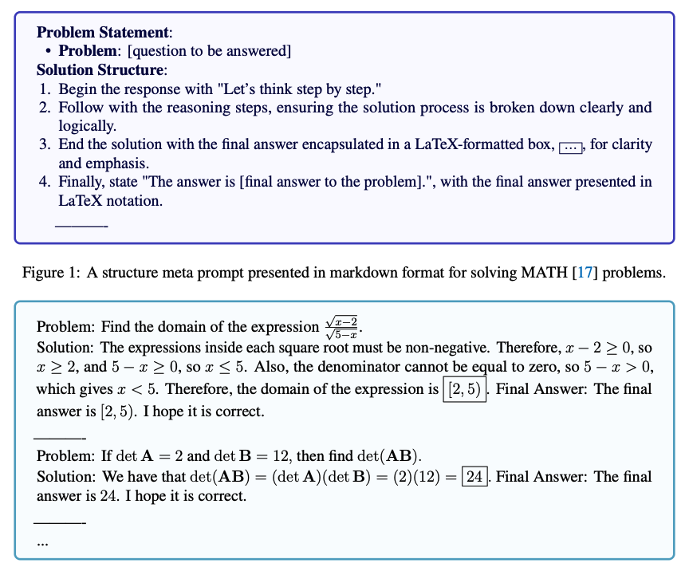

# 元提示

import { Callout } from 'nextra/components'

## 引言

元提示(Meta Prompting)是一种高级提示技术，其重点在于任务与问题的结构与语法特征，而非具体的细节内容。元提示的目标是构建一种更为抽象、结构化的与大型语言模型（LLMs）交互的方式，强调信息的形式与模式，相较于传统的以内容为中心的方法更具优势。

## 核心特征

根据 [Zhang 等(2024)](https://arxiv.org/abs/2311.11482) 的研究，元提示的核心特征可概括如下：

**1. 结构导向性**: 优先考虑问题与解决方案的格式与模式，而非特定内容。

**2. 语法聚焦性**: 使用语法作为预期响应或解决方案的指导模板。

**3. 抽象示例性**: 采用抽象化示例作为框架，展示问题与解决方案的结构，而不拘泥于具体细节。

**4. 多领域适用性**: 适用于各种领域，能够为广泛的问题提供结构化响应。

**5. 类型分类方法**: 基于类型理论，强调提示中组件的分类与逻辑排列。

## 相较于少样本提示的优势

[Zhang 等，2024](https://arxiv.org/abs/2311.11482) 指出，元提示与少样本提示的不同之处在于，元提示更注重结构导向的方法，而少样本提示则侧重于以内容驱动的方式。

以下示例摘自 [Zhang 等(2024)](https://arxiv.org/abs/2311.11482) ，该示例展示了结构化元提示与少样本提示在解决 MATH 基准测试问题中的区别：

元提示相较于少样本提示的优势包括：

**1. 令牌效率高**: 通过关注结构而非详细内容，减少所需 token 数量。

**2. 更公平的比较**: 通过最小化具体示例的影响，提供更公平的模型性能对比方式。

**3. 零样本有效性**: 可视为一种零样本提示形式，其中具体示例的影响被最小化。

<Callout type= "info" emoji="🎓">
如需了解更多关于元提示与高级提示方法的内容，请访问我们的新 AI 课程。[立即加入！](https://dair-ai.thinkific.com/ )
使用优惠码 PROMPTING20 可额外享受 20% 的折扣。
</Callout>

## 应用场景

通过关注解决问题的结构模式，元提示为面对复杂主题提供了清晰的路径，并增强了 LLMs 在各个领域的推理能力。

需要注意的是，元提示也假设语言模型对所处理的具体任务或问题具有内在知识。由于 LLMs 本身能够泛化至未见过的任务，因此它们可以与元提示结合使用，但在面对更加独特和新颖的任务时，其表现可能会下降，这与零样本提示的情况类似。

元提示可用于多种应用场景，包括但不限于复杂的推理任务、数学问题求解、编程挑战、理论性问题等。