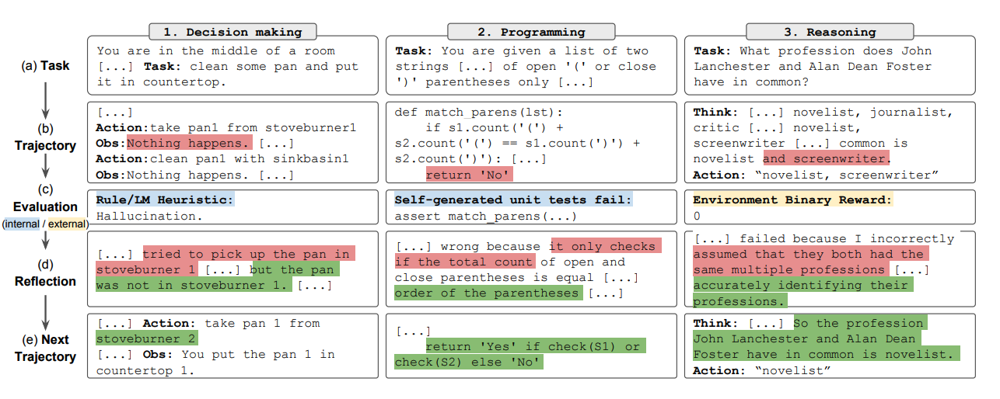

# Reflexion

Reflexion ist ein Framework zur Verstärkung sprachbasierter Agenten durch linguistisches Feedback. Laut [Shinn et al. (2023)](https://arxiv.org/pdf/2303.11366.pdf), "stellt Reflexion ein neues Paradigma für ‚verbale‘ Verstärkung dar, das ein Regelwerk als die Gedächtniskodierung eines Agenten zusammen mit einer Auswahl von LLM-Parametern parametrisiert."

Auf hoher Ebene konvertiert Reflexion Feedback (entweder in Form von freier Sprache oder als Skalar) aus der Umgebung in linguistisches Feedback, auch bekannt als **Selbstreflexion**, welches als Kontext für einen LLM-Agenten im nächsten Durchgang bereitgestellt wird. Dies hilft dem Agenten, schnell und effektiv aus vorherigen Fehlern zu lernen und die Leistung bei vielen fortgeschrittenen Aufgaben zu verbessern.

Wie in der obigen Abbildung gezeigt, besteht Reflexion aus drei unterschiedlichen Modellen:

- **Ein Akteur**: Generiert Text und Handlungen basierend auf den Beobachtungen des Zustands. Der Akteur ergreift eine Handlung in einer Umgebung und erhält eine Beobachtung, die zu einer Ausrichtung führt. [Chain-of-Thought (CoT)](https://www.promptingguide.ai/techniques/cot) und [ReAct](https://www.promptingguide.ai/techniques/react) werden als Akteursmodelle verwendet. Eine Speicherkomponente wird ebenfalls hinzugefügt, um zusätzlichen Kontext für den Agenten bereitzustellen.
- **Ein Bewerter**: Bewerten die vom Akteur produzierten Ausgaben. Konkret nimmt es als Eingabe eine generierte Ausrichtung (auch als Kurzzeitspeicher bezeichnet) und gibt eine Belohnungsbewertung aus. Verschiedene Belohnungsfunktionen werden je nach Aufgabe verwendet (LLMs und regelbasierte Heuristiken werden für Entscheidungsaufgaben verwendet).
- **Selbstreflexion**: Generiert verbale Verstärkungsreize, um dem Akteur bei der Selbstverbesserung zu helfen. Diese Rolle wird von einem LLM erreicht und bietet wertvolles Feedback für zukünftige Versuche. Um spezifisches und relevantes Feedback zu generieren, welches ebenfalls im Speicher gespeichert wird, nutzt das Selbstreflexionsmodell das Belohnungssignal, die aktuelle Trajektorie und seinen dauerhaften Speicher. Diese Erfahrungen (im Langzeitspeicher gespeichert) werden vom Agenten genutzt, um die Entscheidungsfindung schnell zu verbessern.

Zusammengefasst sind die Schlüsselschritte des Reflexionsprozesses a) eine Aufgabe definieren, b) eine Trajektorie generieren, c) bewerten, d) reflektieren und e) die nächste Ausrichtung generieren. Die untenstehende Abbildung zeigt Beispiele dafür, wie ein Reflexionsagent lernen kann, sein Verhalten iterativ zu optimieren, um verschiedene Aufgaben wie Entscheidungsfindung, Programmieren und Argumentation zu lösen. Reflexion erweitert das ReAct-Framework durch die Einführung von Selbstevaluation, Selbstreflexion und Speicherkomponenten.

## Ergebnisse

Experimentelle Ergebnisse zeigen, dass Reflexionsagenten die Leistung bei Entscheidungsfindungsaufgaben in AlfWorld, Denkfragen in HotPotQA und Python-Programmieraufgaben in HumanEval signifikant verbessern.

Bei der Bewertung von sequenziellen Entscheidungsaufgaben (AlfWorld) übertrifft ReAct + Reflexion ReAct deutlich, indem es 130 von 134 Aufgaben mithilfe von Selbstevaluierungstechniken von Heuristik und GPT für binäre Klassifizierung abschließt.

Reflexion übertrifft alle Basisansätze über mehrere Lernschritte hinweg deutlich. Bei Aufgaben, die nur Argumentation betreffen, und bei Hinzufügung eines episodischen Speichers, bestehend aus der neuesten Trajektorie, übertrifft Reflexion + CoT CoT allein und CoT mit episodischem Speicher jeweils.

Wie in der untenstehenden Tabelle zusammengefasst, übertrifft Reflexion im Allgemeinen die bisherigen Spitzenansätze beim Schreiben von Python- und Rust-Code auf MBPP, HumanEval und Leetcode Hard.

## Wann sollte Reflexion verwendet werden?

Reflexion eignet sich am besten für Folgendes:

1. **Ein Agent muss aus Versuch und Irrtum lernen**: Reflexion ist darauf ausgelegt, Agenten dabei zu helfen, ihre Leistung durch Reflexion über vergangene Fehler zu verbessern und dieses Wissen in zukünftige Entscheidungen einfließen zu lassen. Dies macht es besonders geeignet für Aufgaben, bei denen der Agent durch Versuch und Irrtum lernen muss, wie z.B. Entscheidungsfindung, Argumentation und Programmieren.

2. **Traditionelle Verstärkungslernmethoden sind unpraktisch**: Traditionelle Verstärkungslernmethoden (RL) erfordern oft umfangreiche Trainingsdaten und kostspielige Feinabstimmung des Modells. Reflexion bietet eine leichtgewichtige Alternative, die keine Feinabstimmung des zugrundeliegenden Sprachmodells erfordert, was es hinsichtlich Daten und Rechenressourcen effizienter macht.

3. **Nuanciertes Feedback ist erforderlich**: Reflexion nutzt verbales Feedback, das nuancierter und spezifischer als skalare Belohnungen in traditionellen RL-Methoden sein kann. Dies ermöglicht es dem Agenten, seine Fehler besser zu verstehen und gezieltere Verbesserungen in nachfolgenden Versuchen vorzunehmen.

4. **Interpretierbarkeit und explizites Gedächtnis sind wichtig**: Reflexion bietet eine interpretierbarere und explizitere Form des episodischen Gedächtnisses im Vergleich zu traditionellen RL-Methoden. Die Selbstreflexionen des Agenten werden in seinem Speicher gespeichert, was eine einfachere Analyse und Verständnis seines Lernprozesses ermöglicht.

Reflexion ist effektiv bei folgenden Aufgaben:

- **Sequentielle Entscheidungsfindung**: Reflexionsagenten verbessern ihre Leistung bei AlfWorld-Aufgaben, die das Navigieren durch verschiedene Umgebungen und das Abschließen von Mehrschrittaufgaben beinhalten.
- **Argumentation**: Reflexion steigerte die Leistung von Agenten bei HotPotQA, einem Frage-Antwort-Datensatz, der Argumentation über mehrere Dokumente erfordert.
- **Programmierung**: Reflexionsagenten schreiben besseren Code auf Benchmarks wie HumanEval und MBPP und erreichen in einigen Fällen Spitzenleistungen.

Hier sind einige Einschränkungen von Reflexion:

- **Abhängigkeit von den Selbstevaluierungsfähigkeiten**: Reflexion beruht auf der Fähigkeit des Agenten, seine Leistung genau zu bewerten und nützliche Selbstreflexionen zu generieren. Dies kann besonders bei komplexen Aufgaben herausfordernd sein, aber es wird erwartet, dass Reflexion im Laufe der Zeit besser wird, da die Modelle in ihren Fähigkeiten weiter verbessert werden.
- **Langzeitspeicherbeschränkungen**: Reflexion verwendet ein Schiebefenster mit maximaler Kapazität, aber für komplexere Aufgaben könnte es vorteilhaft sein, fortgeschrittene Strukturen wie Vektoreinbettungen oder SQL-Datenbanken zu verwenden.
- **Einschränkungen der Codegenerierung**: Es gibt Einschränkungen bei der testgetriebenen Entwicklung bei der Spezifizierung genauer Eingabe-Ausgabe-Zuordnungen (z.B. nicht-deterministische Generatorfunktionen und von der Hardware beeinflusste Funktionsausgaben).

---

*Quellen der Abbildungen: [Reflexion: Language Agents with Verbal Reinforcement Learning](https://arxiv.org/pdf/2303.11366.pdf)*

## Referenzen

- [Reflexion: Language Agents with Verbal Reinforcement Learning](https://arxiv.org/pdf/2303.11366.pdf)
- [Can LLMs Critique and Iterate on Their Own Outputs?](https://evjang.com/2023/03/26/self-reflection.html)
