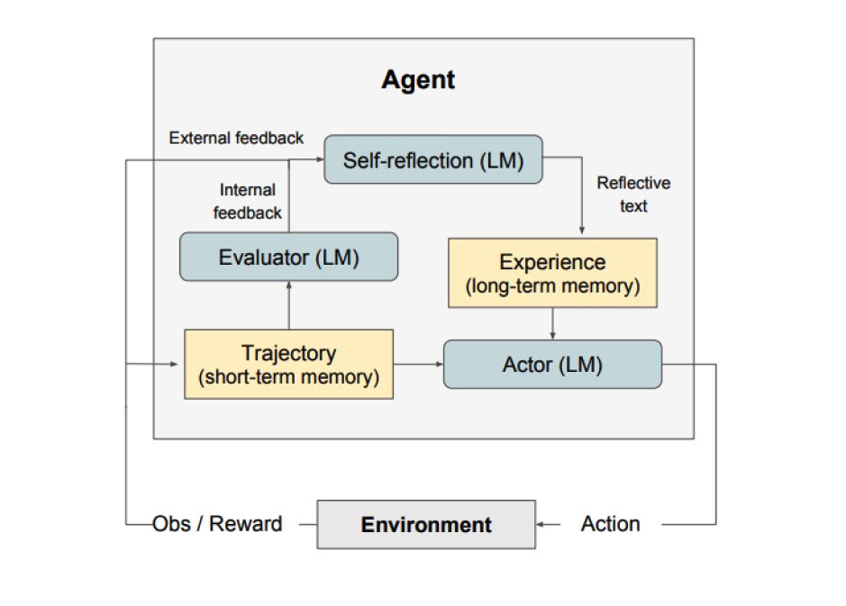
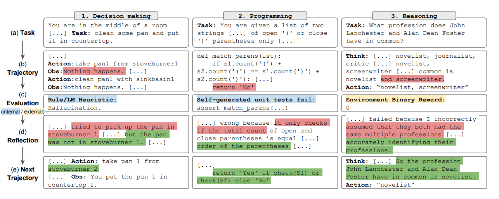
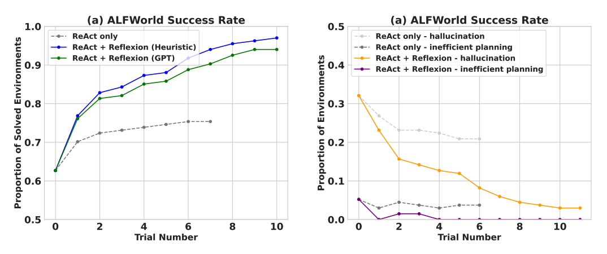
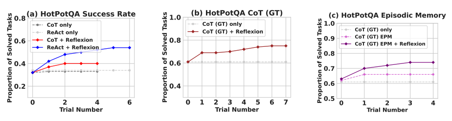
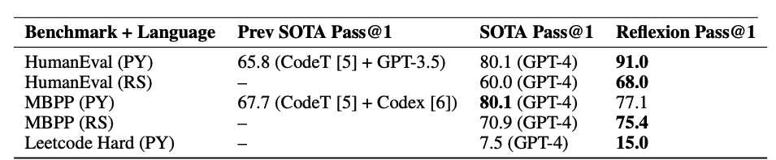

# Reflexion

import { Callout } from 'nextra/components'

Reflexion is a framework to reinforce language-based agents through linguistic feedback. According to [Shinn et al. (2023)](https://arxiv.org/pdf/2303.11366.pdf), "Reflexion is a new paradigm for ‘verbal‘ reinforcement that parameterizes a policy as an agent’s memory encoding paired with a choice of LLM parameters." 

At a high level, Reflexion converts feedback (either free-form language or scalar) from the environment into linguistic feedback, also referred to as **self-reflection**, which is provided as context for an LLM agent in the next episode. This helps the agent rapidly and effectively learn from prior mistakes leading to performance improvements on many advanced tasks.  

As shown in the figure above, Reflexion consists of three distinct models: 

- **An Actor**: Generates text and actions based on the state observations. The Actor takes an action in an environment and receives an observation which results in a trajectory. [Chain-of-Thought (CoT)](https://www.promptingguide.ai/techniques/cot) and [ReAct](https://www.promptingguide.ai/techniques/react) are used as Actor models. A memory component is also added to provide additional context to the agent.
- **An Evaluator**: Scores outputs produced by the Actor. Concretely, it takes as input a generated trajectory (also denoted as short-term memory) and outputs a reward score. Different reward functions are used depending on the task (LLMs and rule-based heuristics are used for decision-making tasks). 
- **Self-Reflection**: Generates verbal reinforcement cues to assist the Actor in self-improvement. This role is achieved by an LLM and provides valuable feedback for future trials. To generate specific and relevant feedback, which is also stored in memory, the self-reflection model makes use of the reward signal, the current trajectory, and its persistent memory. These experiences (stored in long-term memory) are leveraged by the agent to rapidly improve decision-making.

In summary, the key steps of the Reflexion process are a) define a task, b) generate a trajectory, c) evaluate, d) perform reflection, and e) generate the next trajectory. The figure below demonstrates examples of how a Reflexion agent can learn to iteratively optimize its behavior to solve various tasks such as decision-making, programming, and reasoning. Reflexion extends the ReAct framework by introducing self-evaluation, self-reflection and memory components.

## Results

Experimental results demonstrate that Reflexion agents significantly improve performance on decision-making AlfWorld tasks, reasoning questions in HotPotQA, and Python programming tasks on HumanEval. 

When evaluated on sequential decision-making (AlfWorld) tasks, ReAct + Reflexion significantly outperforms ReAct by completing 130/134 tasks using self-evaluation techniques of Heuristic and GPT for binary classification.

Reflexion significantly outperforms all baseline approaches over several learning steps. For reasoning only and when adding an episodic memory consisting of the most recent trajectory, Reflexion + CoT outperforms CoT only and CoT with episodic memory, respectively. 

As summarized in the table below, Reflexion generally outperforms the previous state-of-the-art approaches on Python and Rust code writing on MBPP, HumanEval, and Leetcode Hard.

## When to Use Reflexion?

Reflexion is best suited for the following:

1. **An agent needs to learn from trial and error**: Reflexion is designed to help agents improve their performance by reflecting on past mistakes and incorporating that knowledge into future decisions. This makes it well-suited for tasks where the agent needs to learn through trial and error, such as decision-making, reasoning, and programming.

2. **Traditional reinforcement learning methods are impractical**: Traditional reinforcement learning (RL) methods often require extensive training data and expensive model fine-tuning. Reflexion offers a lightweight alternative that doesn't require fine-tuning the underlying language model, making it more efficient in terms of data and compute resources.

3. **Nuanced feedback is required**: Reflexion utilizes verbal feedback, which can be more nuanced and specific than scalar rewards used in traditional RL. This allows the agent to better understand its mistakes and make more targeted improvements in subsequent trials.

4. **Interpretability and explicit memory are important**: Reflexion provides a more interpretable and explicit form of episodic memory compared to traditional RL methods. The agent's self-reflections are stored in its memory, allowing for easier analysis and understanding of its learning process.

Reflexion is effective in the following tasks:

- **Sequential decision-making**: Reflexion agents improve their performance in AlfWorld tasks, which involve navigating through various environments and completing multi-step objectives.
- **Reasoning**: Reflexion improved the performance of agents on HotPotQA, a question-answering dataset that requires reasoning over multiple documents.
- **Programming**: Reflexion agents write better code on benchmarks like HumanEval and MBPP, achieving state-of-the-art results in some cases.

Here are some limitations of Reflexion:

- **Reliance on self-evaluation capabilities**: Reflexion relies on the agent's ability to accurately evaluate its performance and generate useful self-reflections. This can be challenging, especially for complex tasks but it's expected that Reflexion gets better over time as models keep improving in capabilities.
- **Long-term memory constraints**: Reflexion makes use of a sliding window with maximum capacity but for more complex tasks it may be advantageous to use advanced structures such as vector embedding or SQL databases. 
- **Code generation limitations**: There are limitations to test-driven development in specifying accurate input-output mappings (e.g., non-deterministic generator function and function outputs influenced by hardware).

---

*Figures source: [Reflexion: Language Agents with Verbal Reinforcement Learning](https://arxiv.org/pdf/2303.11366.pdf)*

<Callout type= "info" emoji="🎓">
Learn more about advanced prompting methods in our new AI courses. [Join now!](https://dair-ai.thinkific.com/)
Use code PROMPTING20 to get an extra 20% off.
</Callout>

## References

- [Reflexion: Language Agents with Verbal Reinforcement Learning](https://arxiv.org/pdf/2303.11366.pdf)
- [Can LLMs Critique and Iterate on Their Own Outputs?](https://evjang.com/2023/03/26/self-reflection.html)
