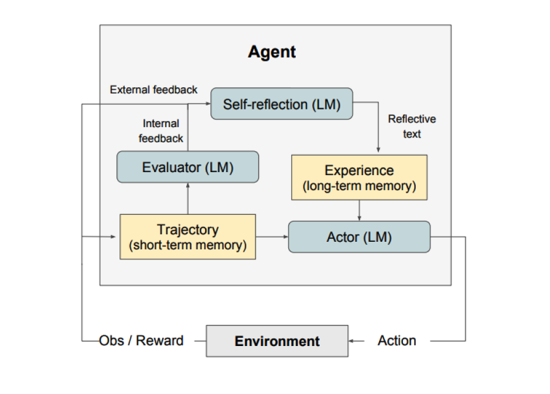

# Reflexion

リフレクションは、言語的フィードバックを通じて言語ベースのエージェントを強化するためのフレームワークです。[Shinn et al. (2023)](https://arxiv.org/pdf/2303.11366.pdf)によると、「リフレクションは、エージェントの記憶エンコーディングとLLMパラメータの選択をパラメータ化することにより、“言葉による”強化を行う新しいパラダイムです。」

概念的には、リフレクションは環境からのフィードバック（自由形式の言語またはスカラー）を言語的フィードバックに変換し、これを自己反省とも呼ばれるものとして次のエピソードでLLMエージェントのコンテキストとして提供します。これにより、エージェントは過去の間違いから迅速かつ効果的に学び、多くの高度なタスクでのパフォーマンスが向上します。

図に示されているように、リフレクションは三つの異なるモデルで構成されています：

- **アクター**: 状態観測に基づいてテキストと行動を生成します。アクターは環境で行動を取り、観測を受け取り、それによって軌跡が生成されます。アクターモデルとしては[Chain-of-Thought (CoT)](https://www.promptingguide.ai/techniques/cot)と [ReAct](https://www.promptingguide.ai/techniques/react) が使用されます。また、追加のコンテキストをエージェントに提供するために記憶コンポーネントも加えられています。

- **評価者**: アクターが生成した出力を採点します。具体的には、生成された軌跡（短期記憶とも表される）を入力として受け取り、報酬スコアを出力します。タスクに応じて異なる報酬関数が使用されます（意思決定タスクにはLLMやルールベースのヒューリスティックが使用されます）。

- **自己反省**: 自己改善を支援するための言語的強化の手がかりを生成します。この役割はLLMによって達成され、将来の試行に対する貴重なフィードバックを提供します。具体的かつ関連性のあるフィードバックを生成するために、自己反省モデルは報酬シグナル、現在の軌跡、および持続的な記憶を活用します。これらの経験（長期記憶に保存されたもの）は、エージェントが意思決定を迅速に改善するために活用されます。

要約すると、リフレクションプロセスの主要なステップは、a) タスクを定義する、b) 軌跡を生成する、c) 評価する、d) 反省を行う、e) 次の軌跡を生成する、です。下の図は、リフレクションエージェントが意思決定、プログラミング、推論など様々なタスクを解決するために行動を反復的に最適化する方法の例を示しています。リフレクションは自己評価、自己反省、記憶コンポーネントを導入することでReActフレームワークを拡張します。

## Results

実験結果によると、リフレクションエージェントは、意思決定タスクであるAlfWorld、推論問題のHotPotQA、HumanEvalでのPythonプログラミングタスクにおいて、パフォーマンスを大幅に向上させています。

連続的な意思決定タスク（AlfWorld）で評価されたとき、ReAct + リフレクションは、HeuristicやGPTを用いた二値分類の自己評価技術を使用して、130/134のタスクを完了し、ReActを大幅に上回りました。

リフレクションは、いくつかの学習ステップにわたり、すべてのベースラインアプローチを大きく上回ります。推論のみの場合や、最新の軌跡から成るエピソード記憶を追加した場合、それぞれ、リフレクション + CoTはCoTのみやCoTとエピソード記憶を併用した場合を上回ります。

以下の表に要約されているように、リフレクションは、MBPP、HumanEval、Leetcode HardでのPythonおよびRustのコード記述において、以前の最先端アプローチを一般的に上回ります。

## When to Use Reflexion?

リフレクションは以下の場合に最適です：

1. **エージェントが試行錯誤から学習する必要がある場合**：リフレクションは、過去の間違いを反省し、その知識を将来の決定に取り入れることで、エージェントのパフォーマンスを向上させるよう設計されています。これは、意思決定、推論、プログラミングなど、試行錯誤を通じて学習する必要があるタスクに適しています。

2. **従来の強化学習方法が非現実的な場合**：従来の強化学習（RL）方法は、多くの訓練データや高価なモデルのファインチューニングを必要とすることが多いです。リフレクションは、基盤となる言語モデルのファインチューニングを必要としない軽量な代替手段を提供し、データと計算リソースの面で効率的です。

3. **繊細なフィードバックが必要な場合**：リフレクションは言語的フィードバックを利用し、従来のRLで使用されるスカラー報酬よりも繊細で具体的です。これにより、エージェントは自身の間違いをよりよく理解し、次の試行でより的確な改善を行うことができます。

4. **解釈可能性と明示的な記憶が重要な場合**：リフレクションは従来のRL方法に比べて、より解釈可能で明示的な形式のエピソード記憶を提供します。エージェントの自己反省はその記憶に保存され、学習プロセスの分析と理解が容易になります。

リフレクションが効果的なタスク：

- **連続的な意思決定**：リフレクションエージェントは、さまざまな環境をナビゲートし、複数ステップの目標を達成するAlfWorldタスクでパフォーマンスを向上します。
- **推論**：リフレクションは、複数の文書にまたがる推論を必要とする質問回答データセットであるHotPotQAで、エージェントのパフォーマンスを向上させました。
- **プログラミング**：リフレクションエージェントは、HumanEvalやMBPPなどのベンチマークでより優れたコードを書き、場合によっては最先端の結果を達成しています。

リフレクションのいくつかの制限：

- **自己評価能力に依存**：リフレクションは、エージェントが自身のパフォーマンスを正確に評価し、有用な自己反省を生成する能力に依存しています。これは、特に複雑なタスクでは困難かもしれませんが、モデルの能力が向上するにつれてリフレクションも時間とともに改善されると期待されます。
- **長期記憶の制約**：リフレクシ

ョンは最大容量のスライディングウィンドウを使用しますが、より複雑なタスクでは、ベクター埋め込みやSQLデータベースなどの高度な構造の使用が有利かもしれません。
- **コード生成の制限**：テスト駆動開発では正確な入出力マッピング（例えば、非決定論的な生成関数やハードウェアに影響を受ける関数の出力など）を指定することに制限があります。

---

*Figures source: [Reflexion: Language Agents with Verbal Reinforcement Learning](https://arxiv.org/pdf/2303.11366.pdf)*

## References

- [Reflexion: Language Agents with Verbal Reinforcement Learning](https://arxiv.org/pdf/2303.11366.pdf)
- [Can LLMs Critique and Iterate on Their Own Outputs?](https://evjang.com/2023/03/26/self-reflection.html)
